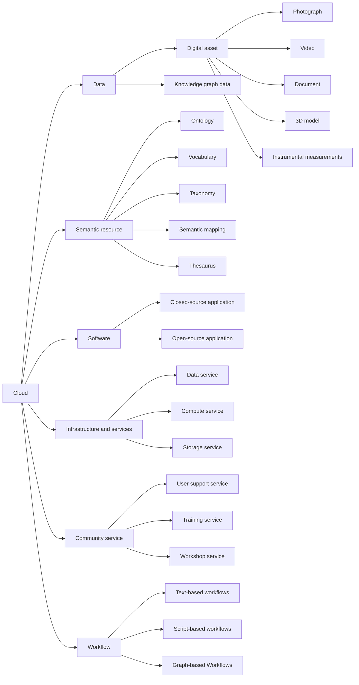

# Resource categories

Resource categories group resources by the kinds of evaluation criteria and metrics that can meaningfully apply to them.

## Hierarchy diagram

## Overview

- [**Cloud**](#cloud) — Top-level category covering all parts of the ECCCH.
    - [**Data**](#data) — Information and datasets managed in the cloud.
        - [**Digital asset**](#digital-asset) — Digitized materials representing heritage content.
            - [**Photograph**](#photograph) — Still image digital assets.
            - [**Video**](#video) — Video recording digital assets.
            - [**Document**](#document) — Text-based digital assets.
            - [**3D model**](#3d-model) — Three-dimensional digital representations.
            - [**Instrumental measurements**](#instrumental-measurements) — Recorded measurements from instruments.
        - [**Knowledge graph data**](#knowledge-graph-data) — Structured semantic data linking heritage entities.
    - [**Semantic resource**](#semantic-resource) — Conceptual and linguistic resources.
        - [**Ontology**](#ontology) — Formal conceptual models of a domain.
        - [**Vocabulary**](#vocabulary) — Controlled lists of terms and definitions.
        - [**Taxonomy**](#taxonomy) — Hierarchical classifications of concepts.
        - [**Semantic mapping**](#semantic-mapping) — Correspondences between different schemas or vocabularies.
        - [**Thesaurus**](#thesaurus) — Semantic networks of related terms.
    - [**Software**](#software) — Applications and software systems.
        - [**Closed-source application**](#closed-source-application) — Proprietary software tools.
        - [**Open-source application**](#open-source-application) — Openly licensed software tools.
    - [**Infrastructure and services**](#infrastructure-and-services) — Underlying hardware, system resources and digital services.
        - [**Data service**](#data-service) — Services providing access to datasets.
        - [**Compute service**](#compute-service) — Services offering computation capabilities.
        - [**Storage service**](#storage-service) — APIs managing data storage operations.
    - [**Community service**](#community-service) — Support and engagement resources for users.
        - [**User support service**](#user-support-service) — Help and assistance for platform users.
        - [**Training service**](#training-service) — Learning and capacity-building activities.
        - [**Workshop service**](#workshop-service) — Interactive events for collaboration and learning.
    - [**Workflow**](#workflow) — Defined sequences of processes and tasks.
        - [**Text-based workflows**](#text-based-workflows) — Workflows documented as textual instructions that are executed manually, providing basic knowledge sharing but limited reproducibility and automation [D3.2].
        - [**Script-based workflows**](#script-based-workflows) — Script based workflows that encode execution logic and can be reused across compatible environments, improving portability, versioning, and partial reproducibility [D3.2].
        - [**Graph-based Workflows**](#graph-based-workflows) — Fully executable and orchestrated workflows managed by the cloud, enabling end to end automation, deep provenance tracking, and federated execution across multiple nodes [D3.2].

## Details

### Cloud

- **ID:** `CATEGORIES_CLOUD`
- **Level:** 0
- **Description:** Top-level category covering all parts of the ECCCH.

#### Data

- **ID:** `CATEGORIES_DATA`
- **Level:** 1
- **Description:** Information and datasets managed in the cloud.

##### Digital asset

- **ID:** `CATEGORIES_DIGITAL_ASSET`
- **Level:** 2
- **Description:** Digitized materials representing heritage content.

###### Photograph

- **ID:** `CATEGORIES_PHOTOGRAPH`
- **Level:** 3
- **Description:** Still image digital assets.

###### Video

- **ID:** `CATEGORIES_VIDEO`
- **Level:** 3
- **Description:** Video recording digital assets.

###### Document

- **ID:** `CATEGORIES_DOCUMENT`
- **Level:** 3
- **Description:** Text-based digital assets.

###### 3D model

- **ID:** `CATEGORIES_D_MODEL`
- **Level:** 3
- **Description:** Three-dimensional digital representations.

###### Instrumental measurements

- **ID:** `CATEGORIES_INSTRUMENTAL_MEASUREMENTS`
- **Level:** 3
- **Description:** Recorded measurements from instruments.

##### Knowledge graph data

- **ID:** `CATEGORIES_KNOWLEDGE_GRAPH_DATA`
- **Level:** 2
- **Description:** Structured semantic data linking heritage entities.

#### Semantic resource

- **ID:** `CATEGORIES_SEMANTIC_RESOURCE`
- **Level:** 1
- **Description:** Conceptual and linguistic resources.

##### Ontology

- **ID:** `CATEGORIES_ONTOLOGY`
- **Level:** 2
- **Description:** Formal conceptual models of a domain.

##### Vocabulary

- **ID:** `CATEGORIES_VOCABULARY`
- **Level:** 2
- **Description:** Controlled lists of terms and definitions.

##### Taxonomy

- **ID:** `CATEGORIES_TAXONOMY`
- **Level:** 2
- **Description:** Hierarchical classifications of concepts.

##### Semantic mapping

- **ID:** `CATEGORIES_SEMANTIC_MAPPING`
- **Level:** 2
- **Description:** Correspondences between different schemas or vocabularies.

##### Thesaurus

- **ID:** `CATEGORIES_THESAURUS`
- **Level:** 2
- **Description:** Semantic networks of related terms.

#### Software

- **ID:** `CATEGORIES_SOFTWARE`
- **Level:** 1
- **Description:** Applications and software systems.

##### Closed-source application

- **ID:** `CATEGORIES_CLOSED_SOURCE_APPLICATION`
- **Level:** 2
- **Description:** Proprietary software tools.

##### Open-source application

- **ID:** `CATEGORIES_OPEN_SOURCE_APPLICATION`
- **Level:** 2
- **Description:** Openly licensed software tools.

#### Infrastructure and services

- **ID:** `CATEGORIES_INFRASTRUCTURE_AND_SERVICES`
- **Level:** 1
- **Description:** Underlying hardware, system resources and digital services.

##### Data service

- **ID:** `CATEGORIES_DATA_SERVICE`
- **Level:** 2
- **Description:** Services providing access to datasets.

##### Compute service

- **ID:** `CATEGORIES_COMPUTE_SERVICE`
- **Level:** 2
- **Description:** Services offering computation capabilities.

##### Storage service

- **ID:** `CATEGORIES_STORAGE_SERVICE`
- **Level:** 2
- **Description:** APIs managing data storage operations.

#### Community service

- **ID:** `CATEGORIES_COMMUNITY_SERVICE`
- **Level:** 1
- **Description:** Support and engagement resources for users.

##### User support service

- **ID:** `CATEGORIES_USER_SUPPORT_SERVICE`
- **Level:** 2
- **Description:** Help and assistance for platform users.

##### Training service

- **ID:** `CATEGORIES_TRAINING_SERVICE`
- **Level:** 2
- **Description:** Learning and capacity-building activities.

##### Workshop service

- **ID:** `CATEGORIES_WORKSHOP_SERVICE`
- **Level:** 2
- **Description:** Interactive events for collaboration and learning.

#### Workflow

- **ID:** `CATEGORIES_WORKFLOW`
- **Level:** 1
- **Description:** Defined sequences of processes and tasks.

##### Text-based workflows

- **ID:** `CATEGORIES_TEXT_BASED_WORKFLOWS`
- **Level:** 2
- **Description:** Workflows documented as textual instructions that are executed manually, providing basic knowledge sharing but limited reproducibility and automation [D3.2].

##### Script-based workflows

- **ID:** `CATEGORIES_SCRIPT_BASED_WORKFLOWS`
- **Level:** 2
- **Description:** Script based workflows that encode execution logic and can be reused across compatible environments, improving portability, versioning, and partial reproducibility [D3.2].

##### Graph-based Workflows

- **ID:** `CATEGORIES_GRAPH_BASED_WORKFLOWS`
- **Level:** 2
- **Description:** Fully executable and orchestrated workflows managed by the cloud, enabling end to end automation, deep provenance tracking, and federated execution across multiple nodes [D3.2].
