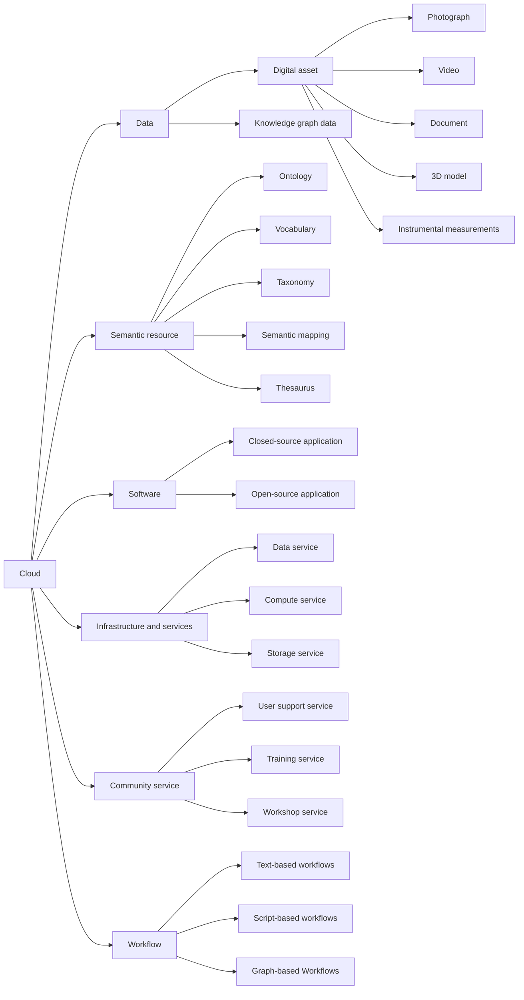

# Resource Categories

To enable a consistent and meaningful evaluation of the ECCCH, resources must be grouped into categories defined in terms of the measures, metrics, and evaluation criteria that are applicable to them. These categories are not primarily conceptual or organizational; rather, they are operational. They are established according to which quality dimensions can be assessed for each type of resource, and which indicators can be reliably defined and measured. Each metric is meaningful only for specific types of resources. For example, cyclomatic complexity applies to a function within the source code of a software application and is typically used to assess structural complexity. It does not apply to an ontology, a dataset, a training course, or a workflow description. Similarly, usability testing protocols are relevant for user facing applications, while semantic consistency metrics are appropriate for ontologies or knowledge models.

Another illustrative example is data accuracy. Its precise meaning and method of measurement vary significantly depending on whether the data under consideration consists of a photograph, a three-dimensional model, a metadata record, or a knowledge graph triple. In each case, accuracy must be defined in relation to the nature of the representation and its intended use.

For this reason, resource categories are defined around resource types for which coherent sets of quality criteria and measurable indicators can be established. These categories closely align with those introduced in Deliverable D3.2. This document seeks to maintain consistency with that classification, while adopting an explicitly evaluative perspective. The focus here is not on integration into the cloud, but on defining how different types of resources can be assessed once they are part of, or interacting with, the ECCCH ecosystem.

## Hierarchy diagram

## Overview

- [**Cloud**](#cloud) — Top-level category covering all parts of the ECCCH.
    - [**Data**](#data) — Information and datasets managed in the cloud.
        - [**Digital asset**](#digital-asset) — Digitized materials representing heritage content.
            - [**Photograph**](#photograph) — Still image digital assets.
            - [**Video**](#video) — Video recording digital assets.
            - [**Document**](#document) — Text-based digital assets.
            - [**3D model**](#3d-model) — Three-dimensional digital representations.
            - [**Instrumental measurements**](#instrumental-measurements) — Recorded measurements from instruments.
        - [**Knowledge graph data**](#knowledge-graph-data) — Structured semantic data linking heritage entities.
    - [**Semantic resource**](#semantic-resource) — Conceptual and linguistic resources.
        - [**Ontology**](#ontology) — Formal conceptual models of a domain.
        - [**Vocabulary**](#vocabulary) — Controlled lists of terms and definitions.
        - [**Taxonomy**](#taxonomy) — Hierarchical classifications of concepts.
        - [**Semantic mapping**](#semantic-mapping) — Correspondences between different schemas or vocabularies.
        - [**Thesaurus**](#thesaurus) — Semantic networks of related terms.
    - [**Software**](#software) — Applications and software systems.
        - [**Closed-source application**](#closed-source-application) — Proprietary software tools.
        - [**Open-source application**](#open-source-application) — Openly licensed software tools.
    - [**Infrastructure and services**](#infrastructure-and-services) — Underlying hardware, system resources and digital services.
        - [**Data service**](#data-service) — Services providing access to datasets.
        - [**Compute service**](#compute-service) — Services offering computation capabilities.
        - [**Storage service**](#storage-service) — APIs managing data storage operations.
    - [**Community service**](#community-service) — Support and engagement resources for users.
        - [**User support service**](#user-support-service) — Help and assistance for platform users.
        - [**Training service**](#training-service) — Learning and capacity-building activities.
        - [**Workshop service**](#workshop-service) — Interactive events for collaboration and learning.
    - [**Workflow**](#workflow) — Defined sequences of processes and tasks.
        - [**Text-based workflows**](#text-based-workflows) — Workflows documented as textual instructions that are executed manually, providing basic knowledge sharing but limited reproducibility and automation [D3.2].
        - [**Script-based workflows**](#script-based-workflows) — Script based workflows that encode execution logic and can be reused across compatible environments, improving portability, versioning, and partial reproducibility [D3.2].
        - [**Graph-based Workflows**](#graph-based-workflows) — Fully executable and orchestrated workflows managed by the cloud, enabling end to end automation, deep provenance tracking, and federated execution across multiple nodes [D3.2].

## Details

### Cloud

- **Level:** 0
- **Description:** Top-level category covering all parts of the ECCCH.

#### Data

- **Level:** 1
- **Description:** Information and datasets managed in the cloud.

##### Digital asset

- **Level:** 2
- **Description:** Digitized materials representing heritage content.

###### Photograph

- **Level:** 3
- **Description:** Still image digital assets.

###### Video

- **Level:** 3
- **Description:** Video recording digital assets.

###### Document

- **Level:** 3
- **Description:** Text-based digital assets.

###### 3D model

- **Level:** 3
- **Description:** Three-dimensional digital representations.

###### Instrumental measurements

- **Level:** 3
- **Description:** Recorded measurements from instruments.

##### Knowledge graph data

- **Level:** 2
- **Description:** Structured semantic data linking heritage entities.

#### Semantic resource

- **Level:** 1
- **Description:** Conceptual and linguistic resources.

##### Ontology

- **Level:** 2
- **Description:** Formal conceptual models of a domain.

##### Vocabulary

- **Level:** 2
- **Description:** Controlled lists of terms and definitions.

##### Taxonomy

- **Level:** 2
- **Description:** Hierarchical classifications of concepts.

##### Semantic mapping

- **Level:** 2
- **Description:** Correspondences between different schemas or vocabularies.

##### Thesaurus

- **Level:** 2
- **Description:** Semantic networks of related terms.

#### Software

- **Level:** 1
- **Description:** Applications and software systems.

##### Closed-source application

- **Level:** 2
- **Description:** Proprietary software tools.

##### Open-source application

- **Level:** 2
- **Description:** Openly licensed software tools.

#### Infrastructure and services

- **Level:** 1
- **Description:** Underlying hardware, system resources and digital services.

##### Data service

- **Level:** 2
- **Description:** Services providing access to datasets.

##### Compute service

- **Level:** 2
- **Description:** Services offering computation capabilities.

##### Storage service

- **Level:** 2
- **Description:** APIs managing data storage operations.

#### Community service

- **Level:** 1
- **Description:** Support and engagement resources for users.

##### User support service

- **Level:** 2
- **Description:** Help and assistance for platform users.

##### Training service

- **Level:** 2
- **Description:** Learning and capacity-building activities.

##### Workshop service

- **Level:** 2
- **Description:** Interactive events for collaboration and learning.

#### Workflow

- **Level:** 1
- **Description:** Defined sequences of processes and tasks.

##### Text-based workflows

- **Level:** 2
- **Description:** Workflows documented as textual instructions that are executed manually, providing basic knowledge sharing but limited reproducibility and automation [D3.2].

##### Script-based workflows

- **Level:** 2
- **Description:** Script based workflows that encode execution logic and can be reused across compatible environments, improving portability, versioning, and partial reproducibility [D3.2].

##### Graph-based Workflows

- **Level:** 2
- **Description:** Fully executable and orchestrated workflows managed by the cloud, enabling end to end automation, deep provenance tracking, and federated execution across multiple nodes [D3.2].
