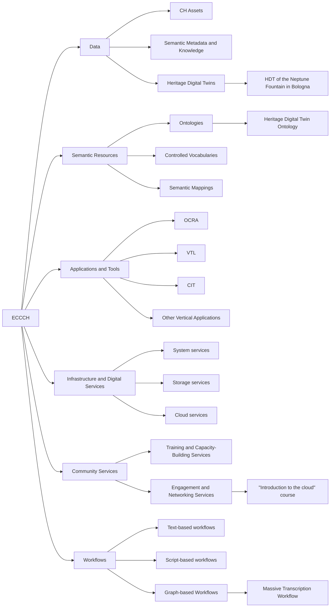

# Components by evaluable units

One way to refine the classification above is to introduce additional levels that identify concrete, individually assessable resources within each component type. This classification is not intended to be exhaustive, and compiling a comprehensive catalog of such resources is beyond the scope of this document. Instead, we provide illustrative examples at the lowest level of the hierarchy, including specific heritage digital twins, ontologies, vertical applications, courses, and workflows. These individual resources represent meaningful and well-defined units that can be independently selected as subjects of evaluation activities. For instance, when planning a usability study, it is appropriate to delimit the scope to one such specific resource.

## Hierarchy diagram

## Overview

- [**ECCCH**](#eccch) — The entire Cultural Heritage Cloud, or ECCCH for short.
    - [**Data**](#data) — This includes the digital heritage assets (digital representations of cultural heritage, such as images, audios and 3D models) that serve as the foundational building blocks for heritage representations within the cloud, as well as the metadata and semantic knowledge accessible through the Cultural Heritage Cloud.
        - [**CH Assets**](#ch-assets) — These are the raw digital materials ("computable data"), such as 3D geometry, text, or audio, that serve as the foundational building blocks for heritage representations within the cloud [D5.3].
        - [**Semantic Metadata and Knowledge**](#semantic-metadata-and-knowledge) — This encompasses the standardized descriptive information and contextual relationships mapped to the Heritage Digital Twin Ontology (HDTO) to provide machine-readable meaning to assets [D3.1].
        - [**Heritage Digital Twins**](#heritage-digital-twins) — Heritage Digital Twins (HDT) are defined as the integrated sum of both computable data and semantic knowledge that capture the full space-time-culture identity of a heritage asset [D5.3].
            - [**HDT of the Neptune Fountain in Bologna**](#hdt-of-the-neptune-fountain-in-bologna) — A hypothetical HDT of the Neptune Fountain in Bologna.
    - [**Semantic Resources**](#semantic-resources) — This encompasses the conceptual and semantic resources that support the ECCCH ecosystem, including the ECHOES Data Model (Heritage Digital Twin Ontology, HDTO), controlled vocabularies, taxonomies, and related metadata schemas used to describe, interlink, and interpret cultural heritage assets.
        - [**Ontologies**](#ontologies) — Ontologies that define the entities and relationships used to describe cultural heritage assets and their properties.
            - [**Heritage Digital Twin Ontology**](#heritage-digital-twin-ontology) — The Heritage Digital Twin Ontology (HDTO) is the data model, based on CIDOC CRM, that will be used in the ECCCH Knowledge Graph to unify descriptions and facilitate query and navigation.
        - [**Controlled Vocabularies**](#controlled-vocabularies) — Structured collections of standardized terms that ensure consistent description and classification of cultural heritage data.
        - [**Semantic Mappings**](#semantic-mappings) — Mappings that define correspondences between ontologies, enabling their interoperability.
    - [**Applications and Tools**](#applications-and-tools) — The applications and other software tools provided by the Cultural Heritage Cloud to support tasks such as data management, visualization, analysis, and user interaction across the ECCCH ecosystem.
        - [**OCRA**](#ocra) — OCRA (Online Conservation and Restoration Annotator) is a cloud-integrated tool for annotating and documenting the conservation and restoration of cultural heritage assets.
        - [**VTL**](#vtl) — The VTL (Virtual Transcription Laboratory) is a cloud-based tool that supports the collaborative transcription, annotation, and enrichment of digitized cultural heritage texts.
        - [**CIT**](#cit) — The CIT (Collection Integration Tool) is a cloud-based application that enables the aggregation, harmonization, and enrichment of cultural heritage collections within the ECHOES ecosystem.
        - [**Other Vertical Applications**](#other-vertical-applications) — Vertical applications from sister projects, cascading grants and other initiatives.
    - [**Infrastructure and Digital Services**](#infrastructure-and-digital-services) — The infrastructure that will provide access to CH data, metadata and digital services in a secure, federated environment. Sample services include user access management, data storage, data sharing, computing resources, search capabilities, workflow management, and Intellectual Property Rights (IPR) services.
        - [**System services**](#system-services) — This includes the SEP gateway, Authentication and Authorization, and other system-level services.
        - [**Storage services**](#storage-services) — Includes RDF triple stores, user space and other storage-related services.
        - [**Cloud services**](#cloud-services) — Services for monitoring, resource management, node management, etc.
    - [**Community Services**](#community-services) — Community-facing services such as workshops, seminars, and other training, engagement and networking programs to support ECCCH stakeholders.
        - [**Training and Capacity-Building Services**](#training-and-capacity-building-services) — Programs, workshops, and learning resources designed to strengthen the digital, technical, and heritage management skills of ECCCH stakeholders.
        - [**Engagement and Networking Services**](#engagement-and-networking-services) — Activities and platforms that promote community participation, knowledge exchange, and collaboration among cultural heritage professionals, researchers, and institutions.
            - [**"Introduction to the cloud" course**](#introduction-to-the-cloud-course) — A course offered by ECHOES that introduces CH professionals, researchers, and developers to the purpose, core concepts, and practical applications of the ECCCH.
    - [**Workflows**](#workflows) — Workflows are structured, potentially automatable sequences of tasks that support the management, analysis, enrichment, preservation, dissemination, and reuse of cultural heritage, enabling their efficient integration and interoperability across the cloud ecosystem.
        - [**Text-based workflows**](#text-based-workflows) — Workflows documented as textual instructions that are executed manually, providing basic knowledge sharing but limited reproducibility and automation [D3.2].
        - [**Script-based workflows**](#script-based-workflows) — Script based workflows that encode execution logic and can be reused across compatible environments, improving portability, versioning, and partial reproducibility [D3.2].
        - [**Graph-based Workflows**](#graph-based-workflows) — Fully executable and orchestrated workflows managed by the cloud, enabling end to end automation, deep provenance tracking, and federated execution across multiple nodes [D3.2].
            - [**Massive Transcription Workflow**](#massive-transcription-workflow) — Hypothetical workflow based on a workflow engine that massively ingests images in one country and performs OCR and processing in another one [D3.1].

## Details

### ECCCH

- **Level:** 0
- **Description:** The entire Cultural Heritage Cloud, or ECCCH for short.

#### Data

- **Level:** 1
- **Description:** This includes the digital heritage assets (digital representations of cultural heritage, such as images, audios and 3D models) that serve as the foundational building blocks for heritage representations within the cloud, as well as the metadata and semantic knowledge accessible through the Cultural Heritage Cloud.

##### CH Assets

- **Level:** 2
- **Description:** These are the raw digital materials ("computable data"), such as 3D geometry, text, or audio, that serve as the foundational building blocks for heritage representations within the cloud [D5.3].

##### Semantic Metadata and Knowledge

- **Level:** 2
- **Description:** This encompasses the standardized descriptive information and contextual relationships mapped to the Heritage Digital Twin Ontology (HDTO) to provide machine-readable meaning to assets [D3.1].

##### Heritage Digital Twins

- **Level:** 2
- **Description:** Heritage Digital Twins (HDT) are defined as the integrated sum of both computable data and semantic knowledge that capture the full space-time-culture identity of a heritage asset [D5.3].

###### HDT of the Neptune Fountain in Bologna

- **Level:** 3
- **Description:** A hypothetical HDT of the Neptune Fountain in Bologna.

#### Semantic Resources

- **Level:** 1
- **Description:** This encompasses the conceptual and semantic resources that support the ECCCH ecosystem, including the ECHOES Data Model (Heritage Digital Twin Ontology, HDTO), controlled vocabularies, taxonomies, and related metadata schemas used to describe, interlink, and interpret cultural heritage assets.

##### Ontologies

- **Level:** 2
- **Description:** Ontologies that define the entities and relationships used to describe cultural heritage assets and their properties.

###### Heritage Digital Twin Ontology

- **Level:** 3
- **Description:** The Heritage Digital Twin Ontology (HDTO) is the data model, based on CIDOC CRM, that will be used in the ECCCH Knowledge Graph to unify descriptions and facilitate query and navigation.

##### Controlled Vocabularies

- **Level:** 2
- **Description:** Structured collections of standardized terms that ensure consistent description and classification of cultural heritage data.

##### Semantic Mappings

- **Level:** 2
- **Description:** Mappings that define correspondences between ontologies, enabling their interoperability.

#### Applications and Tools

- **Level:** 1
- **Description:** The applications and other software tools provided by the Cultural Heritage Cloud to support tasks such as data management, visualization, analysis, and user interaction across the ECCCH ecosystem.

##### OCRA

- **Level:** 2
- **Description:** OCRA (Online Conservation and Restoration Annotator) is a cloud-integrated tool for annotating and documenting the conservation and restoration of cultural heritage assets.

##### VTL

- **Level:** 2
- **Description:** The VTL (Virtual Transcription Laboratory) is a cloud-based tool that supports the collaborative transcription, annotation, and enrichment of digitized cultural heritage texts.

##### CIT

- **Level:** 2
- **Description:** The CIT (Collection Integration Tool) is a cloud-based application that enables the aggregation, harmonization, and enrichment of cultural heritage collections within the ECHOES ecosystem.

##### Other Vertical Applications

- **Level:** 2
- **Description:** Vertical applications from sister projects, cascading grants and other initiatives.

#### Infrastructure and Digital Services

- **Level:** 1
- **Description:** The infrastructure that will provide access to CH data, metadata and digital services in a secure, federated environment. Sample services include user access management, data storage, data sharing, computing resources, search capabilities, workflow management, and Intellectual Property Rights (IPR) services.

##### System services

- **Level:** 2
- **Description:** This includes the SEP gateway, Authentication and Authorization, and other system-level services.

##### Storage services

- **Level:** 2
- **Description:** Includes RDF triple stores, user space and other storage-related services.

##### Cloud services

- **Level:** 2
- **Description:** Services for monitoring, resource management, node management, etc.

#### Community Services

- **Level:** 1
- **Description:** Community-facing services such as workshops, seminars, and other training, engagement and networking programs to support ECCCH stakeholders.

##### Training and Capacity-Building Services

- **Level:** 2
- **Description:** Programs, workshops, and learning resources designed to strengthen the digital, technical, and heritage management skills of ECCCH stakeholders.

##### Engagement and Networking Services

- **Level:** 2
- **Description:** Activities and platforms that promote community participation, knowledge exchange, and collaboration among cultural heritage professionals, researchers, and institutions.

###### "Introduction to the cloud" course

- **Level:** 3
- **Description:** A course offered by ECHOES that introduces CH professionals, researchers, and developers to the purpose, core concepts, and practical applications of the ECCCH.

#### Workflows

- **Level:** 1
- **Description:** Workflows are structured, potentially automatable sequences of tasks that support the management, analysis, enrichment, preservation, dissemination, and reuse of cultural heritage, enabling their efficient integration and interoperability across the cloud ecosystem.

##### Text-based workflows

- **Level:** 2
- **Description:** Workflows documented as textual instructions that are executed manually, providing basic knowledge sharing but limited reproducibility and automation [D3.2].

##### Script-based workflows

- **Level:** 2
- **Description:** Script based workflows that encode execution logic and can be reused across compatible environments, improving portability, versioning, and partial reproducibility [D3.2].

##### Graph-based Workflows

- **Level:** 2
- **Description:** Fully executable and orchestrated workflows managed by the cloud, enabling end to end automation, deep provenance tracking, and federated execution across multiple nodes [D3.2].

###### Massive Transcription Workflow

- **Level:** 3
- **Description:** Hypothetical workflow based on a workflow engine that massively ingests images in one country and performs OCR and processing in another one [D3.1].
