# Components by provider

A provider-oriented view of ECCCH resources.

## Hierarchy diagram

```mermaid
flowchart LR
    components_by_provider_eccch["ECCCH"]
    components_by_provider_data["Data"]
    components_by_provider_eccch --> components_by_provider_data
    components_by_provider_sister_project_data["Sister Project Data"]
    components_by_provider_data --> components_by_provider_sister_project_data
    components_by_provider_cascading_grants_data["Cascading Grants Data"]
    components_by_provider_data --> components_by_provider_cascading_grants_data
    components_by_provider_ri_data["RI Data"]
    components_by_provider_data --> components_by_provider_ri_data
    components_by_provider_national_and_regional["National and Regional Initiative Data"]
    components_by_provider_data --> components_by_provider_national_and_regional
    components_by_provider_individual_and_institutional["Individual and Institutional Data"]
    components_by_provider_data --> components_by_provider_individual_and_institutional
    components_by_provider_semantic_resources["Semantic Resources"]
    components_by_provider_eccch --> components_by_provider_semantic_resources
    components_by_provider_echoes_semantic_resources["ECHOES Semantic Resources"]
    components_by_provider_semantic_resources --> components_by_provider_echoes_semantic_resources
    components_by_provider_sister_projects_and["Sister Projects and Cascading Grants Resources"]
    components_by_provider_semantic_resources --> components_by_provider_sister_projects_and
    components_by_provider_ri_and_umbrella["RI and Umbrella Organizations Resources"]
    components_by_provider_semantic_resources --> components_by_provider_ri_and_umbrella
    components_by_provider_external_adopters_and["External Adopters and Individual CH Institutions"]
    components_by_provider_semantic_resources --> components_by_provider_external_adopters_and
    components_by_provider_applications_and_tools["Applications and Tools"]
    components_by_provider_eccch --> components_by_provider_applications_and_tools
    components_by_provider_echoes_vertical_applications["ECHOES Vertical Applications"]
    components_by_provider_applications_and_tools --> components_by_provider_echoes_vertical_applications
    components_by_provider_sister_projects_and_cascading["Sister Projects and Cascading Grant Applications"]
    components_by_provider_applications_and_tools --> components_by_provider_sister_projects_and_cascading
    components_by_provider_commercial_companies_and["Commercial Companies and Other Adopters"]
    components_by_provider_applications_and_tools --> components_by_provider_commercial_companies_and
    components_by_provider_infrastructure_and_digital["Infrastructure and Digital Services"]
    components_by_provider_eccch --> components_by_provider_infrastructure_and_digital
    components_by_provider_echoes_infrastructure_and["ECHOES Infrastructure and Services"]
    components_by_provider_infrastructure_and_digital --> components_by_provider_echoes_infrastructure_and
    components_by_provider_sister_projects_and_cascading_grant["Sister Projects and Cascading Grant Services"]
    components_by_provider_infrastructure_and_digital --> components_by_provider_sister_projects_and_cascading_grant
    components_by_provider_ris_and_national["RIs and National/International Services"]
    components_by_provider_infrastructure_and_digital --> components_by_provider_ris_and_national
    components_by_provider_community_services["Community Services"]
    components_by_provider_eccch --> components_by_provider_community_services
    components_by_provider_echoes_services["ECHOES Services"]
    components_by_provider_community_services --> components_by_provider_echoes_services
    components_by_provider_sister_projects_and_cascading_grant_services["Sister Projects and Cascading Grant Services"]
    components_by_provider_community_services --> components_by_provider_sister_projects_and_cascading_grant_services
    components_by_provider_ris_umbrella_and["RIs, Umbrella and Network Services"]
    components_by_provider_community_services --> components_by_provider_ris_umbrella_and
```

## Overview

- [**ECCCH**](#eccch) — The entire Cultural Heritage Cloud, or ECCCH for short.
    - [**Data**](#data) — This includes the digital heritage assets (digital representations of cultural heritage, such as images, audios and 3D models) that serve as the foundational building blocks for heritage representations within the cloud, as well as the metadata and semantic knowledge accessible through the Cultural Heritage Cloud.
        - [**Sister Project Data**](#sister-project-data) — Data produced by sister projects (e.g., AUTOMATA, TEXTaiLES, and HERITALISE), which are mandated to integrate their outcomes into the ECCCH [D3.1].
        - [**Cascading Grants Data**](#cascading-grants-data) — Data contributed by external consortia, such as Cultural Heritage Institutions (CHIs), funded through the ECHOES grant program [D3.1].
        - [**RI Data**](#ri-data) — Content provided by RIs such as DARIAH, CLARIN, and E-RIHS [D3.1].
        - [**National and Regional Initiative Data**](#national-and-regional-initiative-data) — Data from large-scale national projects (e.g., ESPADON in France or H2IOSC in Italy) or regional initiatives [D3.1].
        - [**Individual and Institutional Data**](#individual-and-institutional-data) — Data provided by individual or institutional researchers, cultural heritage professionals, and other stakeholders [D3.1].
    - [**Semantic Resources**](#semantic-resources) — This encompasses the conceptual and semantic resources that support the ECCCH ecosystem, including the ECHOES Data Model (Heritage Digital Twin Ontology, HDTO), controlled vocabularies, taxonomies, and related metadata schemas used to describe, interlink, and interpret cultural heritage assets.
        - [**ECHOES Semantic Resources**](#echoes-semantic-resources) — ECHOES will provide the Heritage Digital Twin Ontology (HDTO), the core data model for the cloud.
        - [**Sister Projects and Cascading Grants Resources**](#sister-projects-and-cascading-grants-resources) — These providers contribute specialized ontologies, domain-specific extensions of standards like CIDOC CRM and localized data models tailored to specific research use cases such as textiles or archaeology.
        - [**RI and Umbrella Organizations Resources**](#ri-and-umbrella-organizations-resources) — Bodies such as DARIAH, CLARIN, and E-RIHS, along with networks like ICOMOS and NEMO, provide curated controlled vocabularies, and domain-specific standards [D5.3].
        - [**External Adopters and Individual CH Institutions**](#external-adopters-and-individual-ch-institutions) — These providers contribute metadata mappings and institutional vocabularies to bridge local repositories with the ECCCH Knowledge Base.
    - [**Applications and Tools**](#applications-and-tools) — The applications and other software tools provided by the Cultural Heritage Cloud to support tasks such as data management, visualization, analysis, and user interaction across the ECCCH ecosystem.
        - [**ECHOES Vertical Applications**](#echoes-vertical-applications) — The three initial domain-specific, vertical applications (VAs) developed by ECHOES: the Online Conservation Restoration Annotator (OCRA), the Virtual Transcription Laboratory (VTL), and the Collection Ingestion Tool (CIT).
        - [**Sister Projects and Cascading Grant Applications**](#sister-projects-and-cascading-grant-applications) — This group consists of specialized tools developed by sister projects as well as applications developed by institutions through the Cascading Grants Programme.
        - [**Commercial Companies and Other Adopters**](#commercial-companies-and-other-adopters) — This category encompasses tools provided by the broader ecosystem, including private companies.
    - [**Infrastructure and Digital Services**](#infrastructure-and-digital-services) — The infrastructure that will provide access to CH data, metadata and digital services in a secure, federated environment. Sample services include user access management, data storage, data sharing, computing resources, search capabilities, workflow management, and Intellectual Property Rights (IPR) services.
        - [**ECHOES Infrastructure and Services**](#echoes-infrastructure-and-services) — ECHOES is developing the core infrastructure and cloud components. These include the Single Entry Point (SEP), and services such as the Authentication and Authorisation Infrastructure (AAI) and the core Knowledge Base.
        - [**Sister Projects and Cascading Grant Services**](#sister-projects-and-cascading-grant-services) — These providers contribute specialized digital services and domain-specific tools.
        - [**RIs and National/International Services**](#ris-and-nationalinternational-services) — These providers can offer federated nodes, distributed storage, and advanced computing resources. This category includes established European Research Infrastructures like DARIAH, CLARIN, and E-RIHS, national initiatives (e.g., ESPADON, H2IOSC), and large-scale providers of High-Performance Computing (HPC) and AI Factories (e.g., EuroHPC).
    - [**Community Services**](#community-services) — Community-facing services such as workshops, seminars, and other training, engagement and networking programs to support ECCCH stakeholders.
        - [**ECHOES Services**](#echoes-services) — Services provided by ECHOES team to ensure project-wide awareness and technical baseline readiness. Examples include training modules and consortium-led webinars [D5.3].
        - [**Sister Projects and Cascading Grant Services**](#sister-projects-and-cascading-grant-services) — Services provided by projects funded under ECCCH calls (e.g., AUTOMATA, TEXTaiLES) or through Cascading Grants. These include domain-specific mentorship and training for specific applications [D5.3].
        - [**RIs, Umbrella and Network Services**](#ris-umbrella-and-network-services) — Services provided by established European bodies and professional umbrella organizations.

## Details

## ECCCH

- **ID:** `COMPONENTS_BY_PROVIDER_ECCCH`
- **Level:** 0
- **Description:** The entire Cultural Heritage Cloud, or ECCCH for short.

### Data

- **ID:** `COMPONENTS_BY_PROVIDER_DATA`
- **Level:** 1
- **Description:** This includes the digital heritage assets (digital representations of cultural heritage, such as images, audios and 3D models) that serve as the foundational building blocks for heritage representations within the cloud, as well as the metadata and semantic knowledge accessible through the Cultural Heritage Cloud.

#### Sister Project Data

- **ID:** `COMPONENTS_BY_PROVIDER_SISTER_PROJECT_DATA`
- **Level:** 2
- **Description:** Data produced by sister projects (e.g., AUTOMATA, TEXTaiLES, and HERITALISE), which are mandated to integrate their outcomes into the ECCCH [D3.1].

#### Cascading Grants Data

- **ID:** `COMPONENTS_BY_PROVIDER_CASCADING_GRANTS_DATA`
- **Level:** 2
- **Description:** Data contributed by external consortia, such as Cultural Heritage Institutions (CHIs), funded through the ECHOES grant program [D3.1].

#### RI Data

- **ID:** `COMPONENTS_BY_PROVIDER_RI_DATA`
- **Level:** 2
- **Description:** Content provided by RIs such as DARIAH, CLARIN, and E-RIHS [D3.1].

#### National and Regional Initiative Data

- **ID:** `COMPONENTS_BY_PROVIDER_NATIONAL_AND_REGIONAL`
- **Level:** 2
- **Description:** Data from large-scale national projects (e.g., ESPADON in France or H2IOSC in Italy) or regional initiatives [D3.1].

#### Individual and Institutional Data

- **ID:** `COMPONENTS_BY_PROVIDER_INDIVIDUAL_AND_INSTITUTIONAL`
- **Level:** 2
- **Description:** Data provided by individual or institutional researchers, cultural heritage professionals, and other stakeholders [D3.1].

### Semantic Resources

- **ID:** `COMPONENTS_BY_PROVIDER_SEMANTIC_RESOURCES`
- **Level:** 1
- **Description:** This encompasses the conceptual and semantic resources that support the ECCCH ecosystem, including the ECHOES Data Model (Heritage Digital Twin Ontology, HDTO), controlled vocabularies, taxonomies, and related metadata schemas used to describe, interlink, and interpret cultural heritage assets.

#### ECHOES Semantic Resources

- **ID:** `COMPONENTS_BY_PROVIDER_ECHOES_SEMANTIC_RESOURCES`
- **Level:** 2
- **Description:** ECHOES will provide the Heritage Digital Twin Ontology (HDTO), the core data model for the cloud.

#### Sister Projects and Cascading Grants Resources

- **ID:** `COMPONENTS_BY_PROVIDER_SISTER_PROJECTS_AND`
- **Level:** 2
- **Description:** These providers contribute specialized ontologies, domain-specific extensions of standards like CIDOC CRM and localized data models tailored to specific research use cases such as textiles or archaeology.

#### RI and Umbrella Organizations Resources

- **ID:** `COMPONENTS_BY_PROVIDER_RI_AND_UMBRELLA`
- **Level:** 2
- **Description:** Bodies such as DARIAH, CLARIN, and E-RIHS, along with networks like ICOMOS and NEMO, provide curated controlled vocabularies, and domain-specific standards [D5.3].

#### External Adopters and Individual CH Institutions

- **ID:** `COMPONENTS_BY_PROVIDER_EXTERNAL_ADOPTERS_AND`
- **Level:** 2
- **Description:** These providers contribute metadata mappings and institutional vocabularies to bridge local repositories with the ECCCH Knowledge Base.

### Applications and Tools

- **ID:** `COMPONENTS_BY_PROVIDER_APPLICATIONS_AND_TOOLS`
- **Level:** 1
- **Description:** The applications and other software tools provided by the Cultural Heritage Cloud to support tasks such as data management, visualization, analysis, and user interaction across the ECCCH ecosystem.

#### ECHOES Vertical Applications

- **ID:** `COMPONENTS_BY_PROVIDER_ECHOES_VERTICAL_APPLICATIONS`
- **Level:** 2
- **Description:** The three initial domain-specific, vertical applications (VAs) developed by ECHOES: the Online Conservation Restoration Annotator (OCRA), the Virtual Transcription Laboratory (VTL), and the Collection Ingestion Tool (CIT).

#### Sister Projects and Cascading Grant Applications

- **ID:** `COMPONENTS_BY_PROVIDER_SISTER_PROJECTS_AND_CASCADING`
- **Level:** 2
- **Description:** This group consists of specialized tools developed by sister projects as well as applications developed by institutions through the Cascading Grants Programme.

#### Commercial Companies and Other Adopters

- **ID:** `COMPONENTS_BY_PROVIDER_COMMERCIAL_COMPANIES_AND`
- **Level:** 2
- **Description:** This category encompasses tools provided by the broader ecosystem, including private companies.

### Infrastructure and Digital Services

- **ID:** `COMPONENTS_BY_PROVIDER_INFRASTRUCTURE_AND_DIGITAL`
- **Level:** 1
- **Description:** The infrastructure that will provide access to CH data, metadata and digital services in a secure, federated environment. Sample services include user access management, data storage, data sharing, computing resources, search capabilities, workflow management, and Intellectual Property Rights (IPR) services.

#### ECHOES Infrastructure and Services

- **ID:** `COMPONENTS_BY_PROVIDER_ECHOES_INFRASTRUCTURE_AND`
- **Level:** 2
- **Description:** ECHOES is developing the core infrastructure and cloud components. These include the Single Entry Point (SEP), and services such as the Authentication and Authorisation Infrastructure (AAI) and the core Knowledge Base.

#### Sister Projects and Cascading Grant Services

- **ID:** `COMPONENTS_BY_PROVIDER_SISTER_PROJECTS_AND_CASCADING_GRANT`
- **Level:** 2
- **Description:** These providers contribute specialized digital services and domain-specific tools.

#### RIs and National/International Services

- **ID:** `COMPONENTS_BY_PROVIDER_RIS_AND_NATIONAL`
- **Level:** 2
- **Description:** These providers can offer federated nodes, distributed storage, and advanced computing resources. This category includes established European Research Infrastructures like DARIAH, CLARIN, and E-RIHS, national initiatives (e.g., ESPADON, H2IOSC), and large-scale providers of High-Performance Computing (HPC) and AI Factories (e.g., EuroHPC).

### Community Services

- **ID:** `COMPONENTS_BY_PROVIDER_COMMUNITY_SERVICES`
- **Level:** 1
- **Description:** Community-facing services such as workshops, seminars, and other training, engagement and networking programs to support ECCCH stakeholders.

#### ECHOES Services

- **ID:** `COMPONENTS_BY_PROVIDER_ECHOES_SERVICES`
- **Level:** 2
- **Description:** Services provided by ECHOES team to ensure project-wide awareness and technical baseline readiness. Examples include training modules and consortium-led webinars [D5.3].

#### Sister Projects and Cascading Grant Services

- **ID:** `COMPONENTS_BY_PROVIDER_SISTER_PROJECTS_AND_CASCADING_GRANT_SERVICES`
- **Level:** 2
- **Description:** Services provided by projects funded under ECCCH calls (e.g., AUTOMATA, TEXTaiLES) or through Cascading Grants. These include domain-specific mentorship and training for specific applications [D5.3].

#### RIs, Umbrella and Network Services

- **ID:** `COMPONENTS_BY_PROVIDER_RIS_UMBRELLA_AND`
- **Level:** 2
- **Description:** Services provided by established European bodies and professional umbrella organizations.
