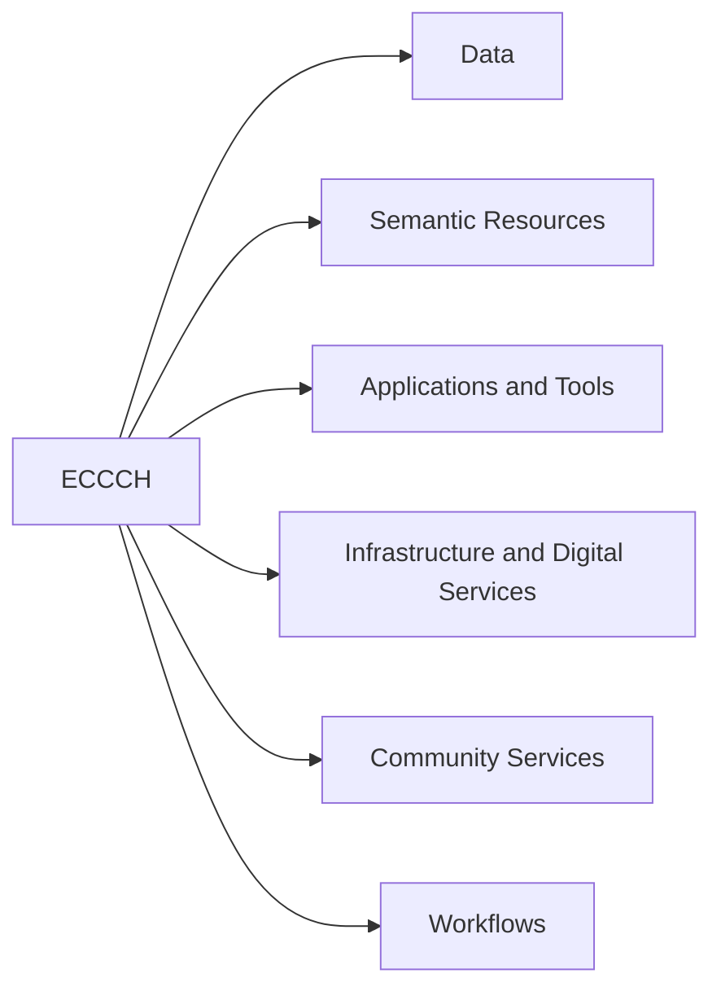

# Main ECCCH components

The first and most basic classification uses the nature of the components, such as data, software applications and services. This criterion is adopted because the nature of each component strongly influences how it can be assessed.

## Hierarchy diagram

## Overview

- [**ECCCH**](#eccch) — The entire Cultural Heritage Cloud, or ECCCH for short.
    - [**Data**](#data) — This includes the digital heritage assets (digital representations of cultural heritage, such as images, audios and 3D models) that serve as the foundational building blocks for heritage representations within the cloud, as well as the metadata and semantic knowledge accessible through the Cultural Heritage Cloud.
    - [**Semantic Resources**](#semantic-resources) — This encompasses the conceptual and semantic resources that support the ECCCH ecosystem, including the ECHOES Data Model (Heritage Digital Twin Ontology, HDTO), controlled vocabularies, taxonomies, and related metadata schemas used to describe, interlink, and interpret cultural heritage assets.
    - [**Applications and Tools**](#applications-and-tools) — The applications and other software tools provided by the Cultural Heritage Cloud to support tasks such as data management, visualization, analysis, and user interaction across the ECCCH ecosystem.
    - [**Infrastructure and Digital Services**](#infrastructure-and-digital-services) — The infrastructure that will provide access to CH data, metadata and digital services in a secure, federated environment. Sample services include user access management, data storage, data sharing, computing resources, search capabilities, workflow management, and Intellectual Property Rights (IPR) services.
    - [**Community Services**](#community-services) — Community-facing services such as workshops, seminars, and other training, engagement and networking programs to support ECCCH stakeholders.
    - [**Workflows**](#workflows) — Workflows are structured, potentially automatable sequences of tasks that support the management, analysis, enrichment, preservation, dissemination, and reuse of cultural heritage, enabling their efficient integration and interoperability across the cloud ecosystem.

## Details

### ECCCH

- **Level:** 0
- **Description:** The entire Cultural Heritage Cloud, or ECCCH for short.

#### Data

- **Level:** 1
- **Description:** This includes the digital heritage assets (digital representations of cultural heritage, such as images, audios and 3D models) that serve as the foundational building blocks for heritage representations within the cloud, as well as the metadata and semantic knowledge accessible through the Cultural Heritage Cloud.

#### Semantic Resources

- **Level:** 1
- **Description:** This encompasses the conceptual and semantic resources that support the ECCCH ecosystem, including the ECHOES Data Model (Heritage Digital Twin Ontology, HDTO), controlled vocabularies, taxonomies, and related metadata schemas used to describe, interlink, and interpret cultural heritage assets.

#### Applications and Tools

- **Level:** 1
- **Description:** The applications and other software tools provided by the Cultural Heritage Cloud to support tasks such as data management, visualization, analysis, and user interaction across the ECCCH ecosystem.

#### Infrastructure and Digital Services

- **Level:** 1
- **Description:** The infrastructure that will provide access to CH data, metadata and digital services in a secure, federated environment. Sample services include user access management, data storage, data sharing, computing resources, search capabilities, workflow management, and Intellectual Property Rights (IPR) services.

#### Community Services

- **Level:** 1
- **Description:** Community-facing services such as workshops, seminars, and other training, engagement and networking programs to support ECCCH stakeholders.

#### Workflows

- **Level:** 1
- **Description:** Workflows are structured, potentially automatable sequences of tasks that support the management, analysis, enrichment, preservation, dissemination, and reuse of cultural heritage, enabling their efficient integration and interoperability across the cloud ecosystem.
