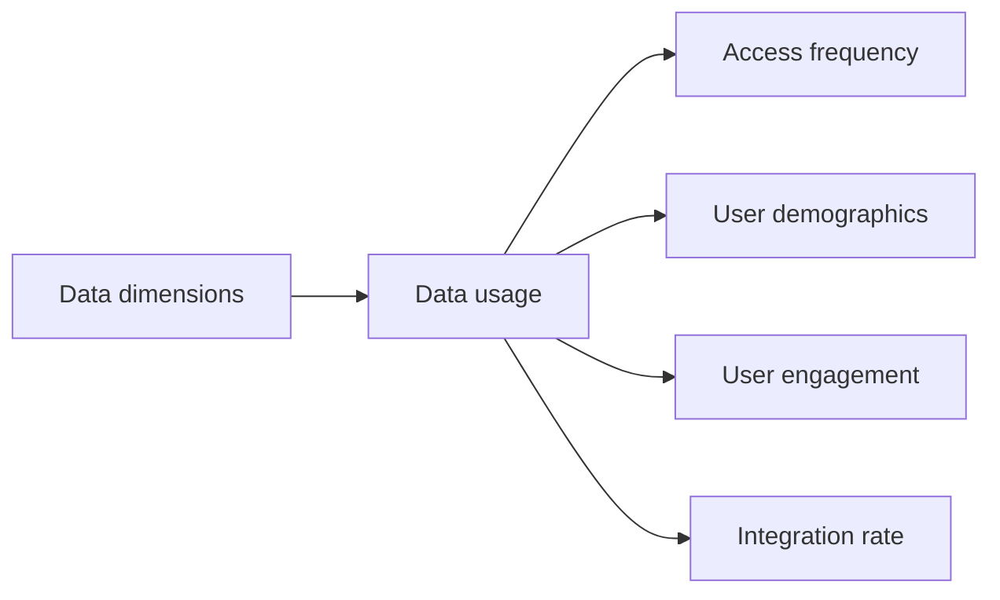

# Data

This page lists the evaluation dimensions and related entries for this resource family.

## Hierarchy diagram

## Overview

- [**Data dimensions**](#data-dimensions)
    - [**Data usage**](#data-usage) — This dimension assesses how datasets, metadata, and paradata are accessed, reused, and integrated within the ECCCH ecosystem, providing insight into their relevance, adoption, and impact.
        - [**Access frequency**](#access-frequency) — Measures how often a dataset or resource is accessed over a given period of time, including views, queries, or downloads, indicating its level of visibility and demand.
        - [**User demographics**](#user-demographics) — Characterizes the types of users accessing the data (e.g., researchers, cultural heritage professionals, educators, general public), enabling analysis of reach across different stakeholder groups.
        - [**User engagement**](#user-engagement) — Evaluates the depth and quality of interaction with the data, including session duration, repeated access, queries performed, or reuse in workflows and applications.
        - [**Integration rate**](#integration-rate) — Measures the extent to which datasets are integrated into applications, workflows, knowledge graphs, or other services within the ECCCH, indicating their level of reuse and interoperability in practice.

### Data dimensions

- **Level:** 0
- **Display:** Data dimensions

#### Data usage

- **Level:** 1
- **Description:** This dimension assesses how datasets, metadata, and paradata are accessed, reused, and integrated within the ECCCH ecosystem, providing insight into their relevance, adoption, and impact.
- **Display:** Data usage

##### Access frequency

- **Level:** 2
- **Description:** Measures how often a dataset or resource is accessed over a given period of time, including views, queries, or downloads, indicating its level of visibility and demand.
- **Example:** (e.g. number of views/downloads over a period; unique vs. returning accesses; peak access times...)
- **Display:** Access frequency

##### User demographics

- **Level:** 2
- **Description:** Characterizes the types of users accessing the data (e.g., researchers, cultural heritage professionals, educators, general public), enabling analysis of reach across different stakeholder groups.
- **Example:** (e.g. geographic distribution of users accessing data; profile of such users...)
- **Display:** User demographics

##### User engagement

- **Level:** 2
- **Description:** Evaluates the depth and quality of interaction with the data, including session duration, repeated access, queries performed, or reuse in workflows and applications.
- **Example:** (e.g. average session duration per HDT, number of HDTs accessed per session, interactions such as annotations, comments, or user-contributed metadata)
- **Display:** User engagement

##### Integration rate

- **Level:** 2
- **Description:** Measures the extent to which datasets are integrated into applications, workflows, knowledge graphs, or other services within the ECCCH, indicating their level of reuse and interoperability in practice.
- **Example:** (e.g. number of times a HDT is integrated into applications, projects, or digital exhibitions; citations of a HDT in publications or presentations)
- **Display:** Integration rate
