# Infrastructure and services

This page lists the evaluation dimensions and related entries for this resource family.

## Hierarchy diagram

```mermaid
flowchart LR
    infrastructure_dim_infrastructure_evaluation_dimensions["Infrastructure Evaluation Dimensions"]
    infrastructure_dim_availability["Availability"]
    infrastructure_dim_infrastructure_evaluation_dimensions --> infrastructure_dim_availability
    infrastructure_dim_service_uptime["Service Uptime"]
    infrastructure_dim_availability --> infrastructure_dim_service_uptime
    infrastructure_dim_redundancy_and_failover["Redundancy and Failover Mechanisms"]
    infrastructure_dim_availability --> infrastructure_dim_redundancy_and_failover
    infrastructure_dim_incident_response_time["Incident Response Time"]
    infrastructure_dim_availability --> infrastructure_dim_incident_response_time
    infrastructure_dim_monitoring_and_alerting["Monitoring and Alerting"]
    infrastructure_dim_availability --> infrastructure_dim_monitoring_and_alerting
    infrastructure_dim_reliability["Reliability"]
    infrastructure_dim_infrastructure_evaluation_dimensions --> infrastructure_dim_reliability
    infrastructure_dim_fault_tolerance["Fault Tolerance"]
    infrastructure_dim_reliability --> infrastructure_dim_fault_tolerance
    infrastructure_dim_data_integrity["Data Integrity"]
    infrastructure_dim_reliability --> infrastructure_dim_data_integrity
    infrastructure_dim_backup_and_recovery["Backup and Recovery Procedures"]
    infrastructure_dim_reliability --> infrastructure_dim_backup_and_recovery
    infrastructure_dim_service_consistency["Service Consistency"]
    infrastructure_dim_reliability --> infrastructure_dim_service_consistency
    infrastructure_dim_performance["Performance"]
    infrastructure_dim_infrastructure_evaluation_dimensions --> infrastructure_dim_performance
    infrastructure_dim_response_time["Response Time"]
    infrastructure_dim_performance --> infrastructure_dim_response_time
    infrastructure_dim_throughput["Throughput"]
    infrastructure_dim_performance --> infrastructure_dim_throughput
    infrastructure_dim_resource_utilization_efficiency["Resource Utilization Efficiency"]
    infrastructure_dim_performance --> infrastructure_dim_resource_utilization_efficiency
    infrastructure_dim_scalability_under_load["Scalability Under Load"]
    infrastructure_dim_performance --> infrastructure_dim_scalability_under_load
    infrastructure_dim_security["Security"]
    infrastructure_dim_infrastructure_evaluation_dimensions --> infrastructure_dim_security
    infrastructure_dim_access_control["Access Control"]
    infrastructure_dim_security --> infrastructure_dim_access_control
    infrastructure_dim_data_protection["Data Protection"]
    infrastructure_dim_security --> infrastructure_dim_data_protection
    infrastructure_dim_vulnerability_management["Vulnerability Management"]
    infrastructure_dim_security --> infrastructure_dim_vulnerability_management
    infrastructure_dim_compliance_and_auditing["Compliance and Auditing"]
    infrastructure_dim_security --> infrastructure_dim_compliance_and_auditing
    infrastructure_dim_accessibility["Accessibility"]
    infrastructure_dim_infrastructure_evaluation_dimensions --> infrastructure_dim_accessibility
    infrastructure_dim_user_interface_accessibility["User Interface Accessibility"]
    infrastructure_dim_accessibility --> infrastructure_dim_user_interface_accessibility
    infrastructure_dim_multilingual_support["Multilingual Support"]
    infrastructure_dim_accessibility --> infrastructure_dim_multilingual_support
    infrastructure_dim_usability_across_devices["Usability Across Devices"]
    infrastructure_dim_accessibility --> infrastructure_dim_usability_across_devices
    infrastructure_dim_inclusive_design_and["Inclusive Design and Support"]
    infrastructure_dim_accessibility --> infrastructure_dim_inclusive_design_and
    infrastructure_dim_sustainability["Sustainability"]
    infrastructure_dim_infrastructure_evaluation_dimensions --> infrastructure_dim_sustainability
    infrastructure_dim_economic_sustainability["Economic Sustainability"]
    infrastructure_dim_sustainability --> infrastructure_dim_economic_sustainability
    infrastructure_dim_environmental_sustainability["Environmental Sustainability"]
    infrastructure_dim_sustainability --> infrastructure_dim_environmental_sustainability
    infrastructure_dim_technical_sustainability["Technical Sustainability"]
    infrastructure_dim_sustainability --> infrastructure_dim_technical_sustainability
    infrastructure_dim_organizational_and_governance["Organizational and Governance Sustainability"]
    infrastructure_dim_sustainability --> infrastructure_dim_organizational_and_governance
```

## Overview

- [**Infrastructure Evaluation Dimensions**](#infrastructure-evaluation-dimensions)
    - [**Availability**](#availability) — This dimension assesses the extent to which the infrastructure and its digital services are continuously operational and accessible, minimizing downtime and ensuring users can reliably access CH resources at any time.
        - [**Service Uptime**](#service-uptime) — Measures the proportion of time that the infrastructure and its services remain fully operational and accessible to users.
        - [**Redundancy and Failover Mechanisms**](#redundancy-and-failover-mechanisms) — Assesses the presence and effectiveness of backup systems, load balancing, and failover strategies that ensure service continuity in case of component failure.
        - [**Incident Response Time**](#incident-response-time) — Evaluates how quickly the infrastructure team can detect, respond to, and resolve outages or service interruptions.
        - [**Monitoring and Alerting**](#monitoring-and-alerting) — Examines the robustness of monitoring systems and real-time alert mechanisms that track service health and performance.
    - [**Reliability**](#reliability) — This dimension evaluates the infrastructure’s ability to deliver consistent and dependable service performance under expected and peak workloads, avoiding system failures and data loss.
        - [**Fault Tolerance**](#fault-tolerance) — Assesses the infrastructure’s capacity to continue operating correctly even when components fail or experience errors.
        - [**Data Integrity**](#data-integrity) — Evaluates mechanisms ensuring that data remains accurate, complete, and consistent during storage, processing, and transmission.
        - [**Backup and Recovery Procedures**](#backup-and-recovery-procedures) — Measures the effectiveness and frequency of data backups and the ability to restore systems quickly after a failure or data loss.
        - [**Service Consistency**](#service-consistency) — Examines the ability of the infrastructure to provide predictable and stable service performance under varying workloads and operational conditions.
    - [**Performance**](#performance) — This dimension measures the responsiveness, speed, and efficiency of the infrastructure and its services in processing, storing, and retrieving CH data and metadata.
        - [**Response Time**](#response-time) — Measures how quickly the infrastructure and its services respond to user actions or data requests.
        - [**Throughput**](#throughput) — Evaluates the volume of operations, transactions, or data processed by the infrastructure within a given time period.
        - [**Resource Utilization Efficiency**](#resource-utilization-efficiency) — Assesses how effectively the system uses available computing resources (CPU, memory, storage, and network) to deliver optimal performance.
        - [**Scalability Under Load**](#scalability-under-load) — Examines the infrastructure’s ability to maintain or improve performance as the number of users, data volume, or computational demand increases.
    - [**Security**](#security) — This dimension evaluates the mechanisms protecting data, metadata, and services from unauthorized access, alteration, or loss, ensuring confidentiality, integrity, and compliance with relevant security standards.
        - [**Access Control**](#access-control) — Assesses the effectiveness of authentication and authorization mechanisms that manage and restrict user access to systems and data.
        - [**Data Protection**](#data-protection) — Evaluates the safeguards ensuring confidentiality, integrity, and availability of CH data during storage, transfer, and processing.
        - [**Vulnerability Management**](#vulnerability-management) — Measures the processes for identifying, assessing, and mitigating security risks, vulnerabilities, and potential threats within the infrastructure.
        - [**Compliance and Auditing**](#compliance-and-auditing) — Examines adherence to relevant security standards and regulations, and the implementation of regular audits to verify compliance and detect anomalies.
    - [**Accessibility**](#accessibility) — This dimension assesses the ease with which users with different technical skills and needs can reach and use the infrastructure’s services, including user interface design, multilingual support, and accessibility for users with disabilities.
        - [**User Interface Accessibility**](#user-interface-accessibility) — Evaluates whether the infrastructure’s interfaces comply with accessibility standards (e.g., WCAG), enabling use by people with diverse abilities.
        - [**Multilingual Support**](#multilingual-support) — Assesses the availability of interfaces, documentation, and user support in multiple languages to serve a broad and inclusive user base.
        - [**Usability Across Devices**](#usability-across-devices) — Measures how effectively the services can be accessed and used from different devices and platforms, including desktops, tablets, and mobile devices.
        - [**Inclusive Design and Support**](#inclusive-design-and-support) — Examines the consideration of users with varying technical skills and digital literacy levels, ensuring equitable access to all functionalities.
    - [**Sustainability**](#sustainability) — This dimension considers the long-term viability of the infrastructure, including its energy efficiency, resource optimization, maintenance plans, and capacity to adapt to technological and institutional changes over time.
        - [**Economic Sustainability**](#economic-sustainability) — Assesses the long-term financial viability of the infrastructure, including funding models, cost efficiency, and maintenance strategies.
        - [**Environmental Sustainability**](#environmental-sustainability) — Evaluates the ecological impact of the infrastructure, focusing on energy efficiency, resource optimization, and adherence to green IT principles.
        - [**Technical Sustainability**](#technical-sustainability) — Measures the capacity of the infrastructure to remain functional, maintainable, and upgradable as technologies and standards evolve.
        - [**Organizational and Governance Sustainability**](#organizational-and-governance-sustainability) — Examines the institutional support, management structures, and policies in place to ensure continuity, accountability, and long-term commitment to the infrastructure.

### Infrastructure Evaluation Dimensions

- **Level:** 0
- **Display:** Infrastructure Evaluation Dimensions

#### Availability

- **Level:** 1
- **Description:** This dimension assesses the extent to which the infrastructure and its digital services are continuously operational and accessible, minimizing downtime and ensuring users can reliably access CH resources at any time.
- **Display:** Availability

##### Service Uptime

- **Level:** 2
- **Description:** Measures the proportion of time that the infrastructure and its services remain fully operational and accessible to users.
- **Display:** Service Uptime

##### Redundancy and Failover Mechanisms

- **Level:** 2
- **Description:** Assesses the presence and effectiveness of backup systems, load balancing, and failover strategies that ensure service continuity in case of component failure.
- **Display:** Redundancy and Failover Mechanisms

##### Incident Response Time

- **Level:** 2
- **Description:** Evaluates how quickly the infrastructure team can detect, respond to, and resolve outages or service interruptions.
- **Display:** Incident Response Time

##### Monitoring and Alerting

- **Level:** 2
- **Description:** Examines the robustness of monitoring systems and real-time alert mechanisms that track service health and performance.
- **Display:** Monitoring and Alerting

#### Reliability

- **Level:** 1
- **Description:** This dimension evaluates the infrastructure’s ability to deliver consistent and dependable service performance under expected and peak workloads, avoiding system failures and data loss.
- **Display:** Reliability

##### Fault Tolerance

- **Level:** 2
- **Description:** Assesses the infrastructure’s capacity to continue operating correctly even when components fail or experience errors.
- **Display:** Fault Tolerance

##### Data Integrity

- **Level:** 2
- **Description:** Evaluates mechanisms ensuring that data remains accurate, complete, and consistent during storage, processing, and transmission.
- **Display:** Data Integrity

##### Backup and Recovery Procedures

- **Level:** 2
- **Description:** Measures the effectiveness and frequency of data backups and the ability to restore systems quickly after a failure or data loss.
- **Display:** Backup and Recovery Procedures

##### Service Consistency

- **Level:** 2
- **Description:** Examines the ability of the infrastructure to provide predictable and stable service performance under varying workloads and operational conditions.
- **Display:** Service Consistency

#### Performance

- **Level:** 1
- **Description:** This dimension measures the responsiveness, speed, and efficiency of the infrastructure and its services in processing, storing, and retrieving CH data and metadata.
- **Display:** Performance

##### Response Time

- **Level:** 2
- **Description:** Measures how quickly the infrastructure and its services respond to user actions or data requests.
- **Display:** Response Time

##### Throughput

- **Level:** 2
- **Description:** Evaluates the volume of operations, transactions, or data processed by the infrastructure within a given time period.
- **Display:** Throughput

##### Resource Utilization Efficiency

- **Level:** 2
- **Description:** Assesses how effectively the system uses available computing resources (CPU, memory, storage, and network) to deliver optimal performance.
- **Display:** Resource Utilization Efficiency

##### Scalability Under Load

- **Level:** 2
- **Description:** Examines the infrastructure’s ability to maintain or improve performance as the number of users, data volume, or computational demand increases.
- **Display:** Scalability Under Load

#### Security

- **Level:** 1
- **Description:** This dimension evaluates the mechanisms protecting data, metadata, and services from unauthorized access, alteration, or loss, ensuring confidentiality, integrity, and compliance with relevant security standards.
- **Display:** Security

##### Access Control

- **Level:** 2
- **Description:** Assesses the effectiveness of authentication and authorization mechanisms that manage and restrict user access to systems and data.
- **Display:** Access Control

##### Data Protection

- **Level:** 2
- **Description:** Evaluates the safeguards ensuring confidentiality, integrity, and availability of CH data during storage, transfer, and processing.
- **Display:** Data Protection

##### Vulnerability Management

- **Level:** 2
- **Description:** Measures the processes for identifying, assessing, and mitigating security risks, vulnerabilities, and potential threats within the infrastructure.
- **Display:** Vulnerability Management

##### Compliance and Auditing

- **Level:** 2
- **Description:** Examines adherence to relevant security standards and regulations, and the implementation of regular audits to verify compliance and detect anomalies.
- **Display:** Compliance and Auditing

#### Accessibility

- **Level:** 1
- **Description:** This dimension assesses the ease with which users with different technical skills and needs can reach and use the infrastructure’s services, including user interface design, multilingual support, and accessibility for users with disabilities.
- **Display:** Accessibility

##### User Interface Accessibility

- **Level:** 2
- **Description:** Evaluates whether the infrastructure’s interfaces comply with accessibility standards (e.g., WCAG), enabling use by people with diverse abilities.
- **Display:** User Interface Accessibility

##### Multilingual Support

- **Level:** 2
- **Description:** Assesses the availability of interfaces, documentation, and user support in multiple languages to serve a broad and inclusive user base.
- **Display:** Multilingual Support

##### Usability Across Devices

- **Level:** 2
- **Description:** Measures how effectively the services can be accessed and used from different devices and platforms, including desktops, tablets, and mobile devices.
- **Display:** Usability Across Devices

##### Inclusive Design and Support

- **Level:** 2
- **Description:** Examines the consideration of users with varying technical skills and digital literacy levels, ensuring equitable access to all functionalities.
- **Display:** Inclusive Design and Support

#### Sustainability

- **Level:** 1
- **Description:** This dimension considers the long-term viability of the infrastructure, including its energy efficiency, resource optimization, maintenance plans, and capacity to adapt to technological and institutional changes over time.
- **Display:** Sustainability

##### Economic Sustainability

- **Level:** 2
- **Description:** Assesses the long-term financial viability of the infrastructure, including funding models, cost efficiency, and maintenance strategies.
- **Display:** Economic Sustainability

##### Environmental Sustainability

- **Level:** 2
- **Description:** Evaluates the ecological impact of the infrastructure, focusing on energy efficiency, resource optimization, and adherence to green IT principles.
- **Display:** Environmental Sustainability

##### Technical Sustainability

- **Level:** 2
- **Description:** Measures the capacity of the infrastructure to remain functional, maintainable, and upgradable as technologies and standards evolve.
- **Display:** Technical Sustainability

##### Organizational and Governance Sustainability

- **Level:** 2
- **Description:** Examines the institutional support, management structures, and policies in place to ensure continuity, accountability, and long-term commitment to the infrastructure.
- **Display:** Organizational and Governance Sustainability
