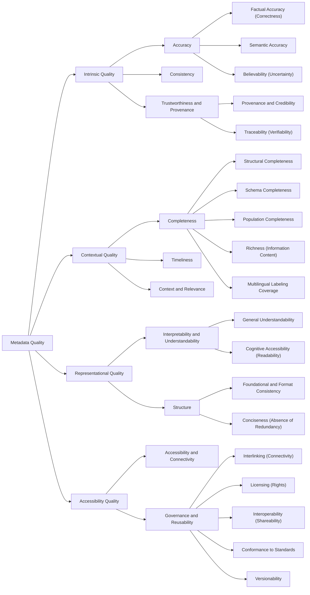

# Metadata

This page lists the evaluation dimensions and related entries for this resource family.

## Hierarchy diagram

## Overview

- [**Metadata Quality**](#metadata-quality) — Degree to which metadata fulfills its role of identifying and describing digital resources in a manner that is understandable by both machines and people.
    - [**Intrinsic Quality**](#intrinsic-quality) — Concerns the inherent properties of metadata that can be evaluated independently of the user's needs or external context; measures whether the metadata is factually correct, coherent, and trustworthy based only on the information within the dataset.
        - [**Accuracy**](#accuracy) — Measures how well metadata represent real-world entities.
            - [**Factual Accuracy (Correctness)**](#factual-accuracy-correctness) — Verifies whether metadata values are free from errors (correct names, dates, identifiers, spatial coordinates, etc.); ensures RDF triples represent facts and the metadata correctly describes the actual resource.
            - [**Semantic Accuracy**](#semantic-accuracy) — Checks whether metadata correctly conveys the meaning and interpretation of the associated resource; assesses whether the meaning conveyed is accurate and appropriate (interpretation, categorization, or alignment between fields and resources).
            - [**Believability (Uncertainty)**](#believability-uncertainty) — Confirms whether uncertainty is explicitly represented and modeled transparently.
        - [**Consistency**](#consistency) — Relates to the coherence of metadata and the absence of contradictions among statements; data should adhere to logical rules defined by the underlying data model (e.g., domain and range constraints). Evaluates as well, whether free-text fields of the same resource (e.g., title, description, subject) describe the same object in a semantically similar way, preventing confusing or contradictory descriptions.
        - [**Trustworthiness and Provenance**](#trustworthiness-and-provenance) — Evaluates the reliability and credibility of the metadata source.
            - [**Provenance and Credibility**](#provenance-and-credibility) — Metadata contains information about the origin of the data, including who created it, their expertise, sources used, and any transformation applied.
            - [**Traceability (Verifiability)**](#traceability-verifiability) — Validates that metadata statements can be connected to authoritative sources (e.g., catalog entries, archival documents, publications, or external datasets).
    - [**Contextual Quality**](#contextual-quality) — Verifies whether metadata is sufficient, timely, and fitting for its domain (beyond being correct).
        - [**Completeness**](#completeness) — Ensures that metadata contains all the information required.
            - [**Structural Completeness**](#structural-completeness) — Assesses whether individual records contain values for all required metadata fields defined by the schema; can be measured as ratio of filled fields to expected fields.
            - [**Schema Completeness**](#schema-completeness) — Validates whether the metadata model itself is appropriately used to describe a given type of resource; assesses whether relevant classes and properties defined in the schema are employed across the dataset.
            - [**Population Completeness**](#population-completeness) — Assesses the extent to which real-world objects are represented in the dataset.
            - [**Richness (Information Content)**](#richness-information-content) — Evaluates the amount and diversity of descriptive information available for a resource; adds a gradual, qualitative layer beyond the minimum ensured by structural completeness.
            - [**Multilingual Labeling Coverage**](#multilingual-labeling-coverage) — Validates the presence, correctness, and consistency of multilingual metadata; includes appropriate language tags and consistency across multilingual descriptions.
        - [**Timeliness**](#timeliness) — Ensures that metadata remains up-to-date and relevant to the present; modification dates should be documented to avoid outdated contradictory knowledge.
        - [**Context and Relevance**](#context-and-relevance) — Measures whether the metadata is useful for the intended audience or use case; assesses whether the information meets the user's needs.
    - [**Representational Quality**](#representational-quality) — Evaluates how well the data is expressed, structured, and presented; focuses on readability, interpretability, structural representation, and the quality of language.
        - [**Interpretability and Understandability**](#interpretability-and-understandability) — Evaluates how easily interpretable by human users and machine agents metadata is; identifies poor wording, lack of context, and ambiguous phrasing.
            - [**General Understandability**](#general-understandability) — Assesses whether data is presented clearly and can be easily interpreted by its intended audience (user or machine); influenced by schema usage and clarity of labels, identifiers, and short descriptive fields.
            - [**Cognitive Accessibility (Readability)**](#cognitive-accessibility-readability) — Checks whether textual metadata is easy to read; focuses on the cognitive effort required to read it (assuming it is already interpretable).
        - [**Structure**](#structure) — Concerned with the syntactic and structural correctness of metadata; validates representation types including URIs and RDF constructs.
            - [**Foundational and Format Consistency**](#foundational-and-format-consistency) — Checks whether metadata respects structural and syntactic rules of the underlying data model (datatype compliance, correct use of object vs. datatype properties, valid/resolvable URIs, valid language-tagged strings).
            - [**Conciseness (Absence of Redundancy)**](#conciseness-absence-of-redundancy) — Evaluates how efficiently metadata describes resources; checks for unnecessary redundancy such as duplicate entities under multiple identifiers or repeated equivalent values.
    - [**Accessibility Quality**](#accessibility-quality) — Assesses how easily the data can be found, accessed, and reused.
        - [**Accessibility and Connectivity**](#accessibility-and-connectivity) — Ensures metadata can be accessed reliably in Knowledge Graphs and Linked Data; checks dereferenceable URIs, reachable resources, downloadable metadata files in standard formats, and stable/responsive endpoints.
        - [**Governance and Reusability**](#governance-and-reusability) — Ensures metadata can be reused, shared, and maintained long-term.
            - [**Interlinking (Connectivity)**](#interlinking-connectivity) — Verifies both internal and external metadata links, including links to authority files, equivalences, and internal links between related resources.
            - [**Licensing (Rights)**](#licensing-rights) — Checks that metadata includes accurate information about rights, permissions, and licensing, which determines whether metadata can be reused and under what conditions.
            - [**Interoperability (Shareability)**](#interoperability-shareability) — Evaluates the ease with which metadata can be shared across systems/platforms/institutions; assesses use of common standards, adherence to controlled vocabularies, and compatibility with Linked Data technologies.
            - [**Conformance to Standards**](#conformance-to-standards) — Assesses whether metadata follows community standards, schemas, and best practices, supporting reusability and automated validation.
            - [**Versionability**](#versionability) — Capacity to maintain multiple versions of the same record, track changes over time, and allow rollback in case of errors.

### Metadata Quality

- **Level:** 0
- **Description:** Degree to which metadata fulfills its role of identifying and describing digital resources in a manner that is understandable by both machines and people.
- **Display:** Metadata Quality
- **Contributors:** Alexandra Sicobean (UPC), Imanol Muñoz-Pandiella (UPC), Carlos Andujar (UPC)
- **Reviewers:** Alexandra Sicobean (UPC)

#### Intrinsic Quality

- **Level:** 1
- **Description:** Concerns the inherent properties of metadata that can be evaluated independently of the user's needs or external context; measures whether the metadata is factually correct, coherent, and trustworthy based only on the information within the dataset.
- **Display:** Intrinsic Quality
- **Contributors:** Alexandra Sicobean (UPC), Imanol Muñoz-Pandiella (UPC), Carlos Andujar (UPC)
- **Reviewers:** Alexandra Sicobean (UPC)

##### Accuracy

- **Level:** 2
- **Description:** Measures how well metadata represent real-world entities.
- **Display:** Accuracy
- **Contributors:** Alexandra Sicobean (UPC), Imanol Muñoz-Pandiella (UPC), Carlos Andujar (UPC)
- **Reviewers:** Alexandra Sicobean (UPC)

###### Factual Accuracy (Correctness)

- **Level:** 3
- **Description:** Verifies whether metadata values are free from errors (correct names, dates, identifiers, spatial coordinates, etc.); ensures RDF triples represent facts and the metadata correctly describes the actual resource.
- **Example:** In Wikidata, the entity Q42 (Douglas Adams) has shown incorrect values for his place of death or birth due to user edits
- **Display:** Factual Accuracy (Correctness)
- **Contributors:** Alexandra Sicobean (UPC), Imanol Muñoz-Pandiella (UPC), Carlos Andujar (UPC)
- **Reviewers:** Alexandra Sicobean (UPC)

###### Semantic Accuracy

- **Level:** 3
- **Description:** Checks whether metadata correctly conveys the meaning and interpretation of the associated resource; assesses whether the meaning conveyed is accurate and appropriate (interpretation, categorization, or alignment between fields and resources).
- **Example:** A book about women in science during the 19th century described with the subject ”biography”, when in fact the subject is ”thematic historical study”
- **Display:** Semantic Accuracy
- **Contributors:** Alexandra Sicobean (UPC), Imanol Muñoz-Pandiella (UPC), Carlos Andujar (UPC)
- **Reviewers:** Alexandra Sicobean (UPC)

###### Believability (Uncertainty)

- **Level:** 3
- **Description:** Confirms whether uncertainty is explicitly represented and modeled transparently.
- **Example:** Wikidata indicates doubts by storing properties with ”low-confidence” qualifiers (e.g., conflicting birth years)
- **Display:** Believability (Uncertainty)
- **Contributors:** Alexandra Sicobean (UPC), Imanol Muñoz-Pandiella (UPC), Carlos Andujar (UPC)
- **Reviewers:** Alexandra Sicobean (UPC)

##### Consistency

- **Level:** 2
- **Description:** Relates to the coherence of metadata and the absence of contradictions among statements; data should adhere to logical rules defined by the underlying data model (e.g., domain and range constraints). Evaluates as well, whether free-text fields of the same resource (e.g., title, description, subject) describe the same object in a semantically similar way, preventing confusing or contradictory descriptions.
- **Example:** In CIDOCCRM (version 7.1.3), the property P11 had participant / participated in has domain E5 Event and range E39 Actor. A correct example of consistency would be Napoleon Bonaparte (E39 Actor) participated in the French Revolution (E5 Event). By contrast, an inconsistent statement would be Mona Lisa (a physical object violating the domain) participated in Paris (a place, violating the range). An item having the title ”Memorial Statue of Queen Victoria”, providing a description such as ”Bronze sculpture of unknown woman”
- **Display:** Consistency
- **Contributors:** Alexandra Sicobean (UPC), Imanol Muñoz-Pandiella (UPC), Carlos Andujar (UPC)
- **Reviewers:** Alexandra Sicobean (UPC)

##### Trustworthiness and Provenance

- **Level:** 2
- **Description:** Evaluates the reliability and credibility of the metadata source.
- **Display:** Trustworthiness and Provenance
- **Contributors:** Alexandra Sicobean (UPC), Imanol Muñoz-Pandiella (UPC), Carlos Andujar (UPC)
- **Reviewers:** Alexandra Sicobean (UPC)

###### Provenance and Credibility

- **Level:** 3
- **Description:** Metadata contains information about the origin of the data, including who created it, their expertise, sources used, and any transformation applied.
- **Example:** A reference URL to an unreliable blog or a missing webpage
- **Display:** Provenance and Credibility
- **Contributors:** Alexandra Sicobean (UPC), Imanol Muñoz-Pandiella (UPC), Carlos Andujar (UPC)
- **Reviewers:** Alexandra Sicobean (UPC)

###### Traceability (Verifiability)

- **Level:** 3
- **Description:** Validates that metadata statements can be connected to authoritative sources (e.g., catalog entries, archival documents, publications, or external datasets).
- **Example:** A DBpedia triple asserting that an author won an award without providing citations or a reference to the Wikipedia source
- **Display:** Traceability (Verifiability)
- **Contributors:** Alexandra Sicobean (UPC), Imanol Muñoz-Pandiella (UPC), Carlos Andujar (UPC)
- **Reviewers:** Alexandra Sicobean (UPC)

#### Contextual Quality

- **Level:** 1
- **Description:** Verifies whether metadata is sufficient, timely, and fitting for its domain (beyond being correct).
- **Display:** Contextual Quality
- **Contributors:** Alexandra Sicobean (UPC), Imanol Muñoz-Pandiella (UPC), Carlos Andujar (UPC)
- **Reviewers:** Alexandra Sicobean (UPC)

##### Completeness

- **Level:** 2
- **Description:** Ensures that metadata contains all the information required.
- **Display:** Completeness
- **Contributors:** Alexandra Sicobean (UPC), Imanol Muñoz-Pandiella (UPC), Carlos Andujar (UPC)
- **Reviewers:** Alexandra Sicobean (UPC)

###### Structural Completeness

- **Level:** 3
- **Description:** Assesses whether individual records contain values for all required metadata fields defined by the schema; can be measured as ratio of filled fields to expected fields.
- **Example:** A book that contains title, author, and publication date as fields, but lacks the ISBN identifier
- **Display:** Structural Completeness
- **Contributors:** Alexandra Sicobean (UPC), Imanol Muñoz-Pandiella (UPC), Carlos Andujar (UPC)
- **Reviewers:** Alexandra Sicobean (UPC)

###### Schema Completeness

- **Level:** 3
- **Description:** Validates whether the metadata model itself is appropriately used to describe a given type of resource; assesses whether relevant classes and properties defined in the schema are employed across the dataset.
- **Example:** People described without birth place despite schema support.
- **Display:** Schema Completeness
- **Contributors:** Alexandra Sicobean (UPC), Imanol Muñoz-Pandiella (UPC), Carlos Andujar (UPC)
- **Reviewers:** Alexandra Sicobean (UPC)

###### Population Completeness

- **Level:** 3
- **Description:** Assesses the extent to which real-world objects are represented in the dataset.
- **Example:** If a museum has 500 artifacts, but only 350 are published, population completeness is 70%.
- **Display:** Population Completeness
- **Contributors:** Alexandra Sicobean (UPC), Imanol Muñoz-Pandiella (UPC), Carlos Andujar (UPC)
- **Reviewers:** Alexandra Sicobean (UPC)

###### Richness (Information Content)

- **Level:** 3
- **Description:** Evaluates the amount and diversity of descriptive information available for a resource; adds a gradual, qualitative layer beyond the minimum ensured by structural completeness.
- **Example:** Consider two Wikidata entries for historical monuments: one with detailed architectural style, heritage designation, materials, and images; another with only the title and the location. Although both entities are considered complete at a basic level, the second one provides only a minimal identification and lacks descriptive richness
- **Display:** Richness (Information Content)
- **Contributors:** Alexandra Sicobean (UPC), Imanol Muñoz-Pandiella (UPC), Carlos Andujar (UPC)
- **Reviewers:** Alexandra Sicobean (UPC)

###### Multilingual Labeling Coverage

- **Level:** 3
- **Description:** Validates the presence, correctness, and consistency of multilingual metadata; includes appropriate language tags and consistency across multilingual descriptions.
- **Example:** Multilingual environments require language-tagged labels for search and discovery
- **Display:** Multilingual Labeling Coverage
- **Contributors:** Alexandra Sicobean (UPC), Imanol Muñoz-Pandiella (UPC), Carlos Andujar (UPC)
- **Reviewers:** Alexandra Sicobean (UPC)

##### Timeliness

- **Level:** 2
- **Description:** Ensures that metadata remains up-to-date and relevant to the present; modification dates should be documented to avoid outdated contradictory knowledge.
- **Example:** An item representing a politician might still contain an outdated position (e.g., Mayor from 2010 to 2014) Records associated with a museum might have been moved or loaned to another institution without being updated.
- **Display:** Timeliness
- **Contributors:** Alexandra Sicobean (UPC), Imanol Muñoz-Pandiella (UPC), Carlos Andujar (UPC)
- **Reviewers:** Alexandra Sicobean (UPC)

##### Context and Relevance

- **Level:** 2
- **Description:** Measures whether the metadata is useful for the intended audience or use case; assesses whether the information meets the user's needs.
- **Example:** Metadata designed for cultural heritage programs may prioritize visual material and narrative descriptions, while metadata intended for scholarly research should include references to primary sources and detailed provenance.
- **Display:** Context and Relevance
- **Contributors:** Alexandra Sicobean (UPC), Imanol Muñoz-Pandiella (UPC), Carlos Andujar (UPC)
- **Reviewers:** Alexandra Sicobean (UPC)

#### Representational Quality

- **Level:** 1
- **Description:** Evaluates how well the data is expressed, structured, and presented; focuses on readability, interpretability, structural representation, and the quality of language.
- **Display:** Representational Quality
- **Contributors:** Alexandra Sicobean (UPC), Imanol Muñoz-Pandiella (UPC), Carlos Andujar (UPC)
- **Reviewers:** Alexandra Sicobean (UPC)

##### Interpretability and Understandability

- **Level:** 2
- **Description:** Evaluates how easily interpretable by human users and machine agents metadata is; identifies poor wording, lack of context, and ambiguous phrasing.
- **Display:** Interpretability and Understandability
- **Contributors:** Alexandra Sicobean (UPC), Imanol Muñoz-Pandiella (UPC), Carlos Andujar (UPC)
- **Reviewers:** Alexandra Sicobean (UPC)

###### General Understandability

- **Level:** 3
- **Description:** Assesses whether data is presented clearly and can be easily interpreted by its intended audience (user or machine); influenced by schema usage and clarity of labels, identifiers, and short descriptive fields.
- **Example:** A record using abbreviated or highly technical codes (e.g., loc crt: FR-75) without explanation may be difficult to interpret, even if it is technically correct
- **Display:** General Understandability
- **Contributors:** Alexandra Sicobean (UPC), Imanol Muñoz-Pandiella (UPC), Carlos Andujar (UPC)
- **Reviewers:** Alexandra Sicobean (UPC)

###### Cognitive Accessibility (Readability)

- **Level:** 3
- **Description:** Checks whether textual metadata is easy to read; focuses on the cognitive effort required to read it (assuming it is already interpretable).
- **Example:** Long, technical, or machine-translated abstracts with reduced readability for general audiences
- **Display:** Cognitive Accessibility (Readability)
- **Contributors:** Alexandra Sicobean (UPC), Imanol Muñoz-Pandiella (UPC), Carlos Andujar (UPC)
- **Reviewers:** Alexandra Sicobean (UPC)

##### Structure

- **Level:** 2
- **Description:** Concerned with the syntactic and structural correctness of metadata; validates representation types including URIs and RDF constructs.
- **Display:** Structure
- **Contributors:** Alexandra Sicobean (UPC), Imanol Muñoz-Pandiella (UPC), Carlos Andujar (UPC)
- **Reviewers:** Alexandra Sicobean (UPC)

###### Foundational and Format Consistency

- **Level:** 3
- **Description:** Checks whether metadata respects structural and syntactic rules of the underlying data model (datatype compliance, correct use of object vs. datatype properties, valid/resolvable URIs, valid language-tagged strings).
- **Example:** Textual fields, for instance, are evaluated only with respect to their datatype and encoding (valid string literals, language tags)
- **Display:** Foundational and Format Consistency
- **Contributors:** Alexandra Sicobean (UPC), Imanol Muñoz-Pandiella (UPC), Carlos Andujar (UPC)
- **Reviewers:** Alexandra Sicobean (UPC)

###### Conciseness (Absence of Redundancy)

- **Level:** 3
- **Description:** Evaluates how efficiently metadata describes resources; checks for unnecessary redundancy such as duplicate entities under multiple identifiers or repeated equivalent values.
- **Example:** Identical entities under multiple identifiers or repetition of properties with equivalent values
- **Display:** Conciseness (Absence of Redundancy)
- **Contributors:** Alexandra Sicobean (UPC), Imanol Muñoz-Pandiella (UPC), Carlos Andujar (UPC)
- **Reviewers:** Alexandra Sicobean (UPC)

#### Accessibility Quality

- **Level:** 1
- **Description:** Assesses how easily the data can be found, accessed, and reused.
- **Display:** Accessibility Quality
- **Contributors:** Alexandra Sicobean (UPC), Imanol Muñoz-Pandiella (UPC), Carlos Andujar (UPC)
- **Reviewers:** Alexandra Sicobean (UPC)

##### Accessibility and Connectivity

- **Level:** 2
- **Description:** Ensures metadata can be accessed reliably in Knowledge Graphs and Linked Data; checks dereferenceable URIs, reachable resources, downloadable metadata files in standard formats, and stable/responsive endpoints.
- **Example:** Broken URIs, inaccessible endpoints, or missing download links.
- **Display:** Accessibility and Connectivity
- **Contributors:** Alexandra Sicobean (UPC), Imanol Muñoz-Pandiella (UPC), Carlos Andujar (UPC)
- **Reviewers:** Alexandra Sicobean (UPC)

##### Governance and Reusability

- **Level:** 2
- **Description:** Ensures metadata can be reused, shared, and maintained long-term.
- **Display:** Governance and Reusability
- **Contributors:** Alexandra Sicobean (UPC), Imanol Muñoz-Pandiella (UPC), Carlos Andujar (UPC)
- **Reviewers:** Alexandra Sicobean (UPC)

###### Interlinking (Connectivity)

- **Level:** 3
- **Description:** Verifies both internal and external metadata links, including links to authority files, equivalences, and internal links between related resources.
- **Example:** Artist not linked to authority file (e.g., VIAF).
- **Display:** Interlinking (Connectivity)
- **Contributors:** Alexandra Sicobean (UPC), Imanol Muñoz-Pandiella (UPC), Carlos Andujar (UPC)
- **Reviewers:** Alexandra Sicobean (UPC)

###### Licensing (Rights)

- **Level:** 3
- **Description:** Checks that metadata includes accurate information about rights, permissions, and licensing, which determines whether metadata can be reused and under what conditions.
- **Example:** Image without license information.
- **Display:** Licensing (Rights)
- **Contributors:** Alexandra Sicobean (UPC), Imanol Muñoz-Pandiella (UPC), Carlos Andujar (UPC)
- **Reviewers:** Alexandra Sicobean (UPC)

###### Interoperability (Shareability)

- **Level:** 3
- **Description:** Evaluates the ease with which metadata can be shared across systems/platforms/institutions; assesses use of common standards, adherence to controlled vocabularies, and compatibility with Linked Data technologies.
- **Example:** Two knowledge graphs using different vocabularies for the same concept: one referring to the creator as schema:creator, and the other one as dc:creator
- **Display:** Interoperability (Shareability)
- **Contributors:** Alexandra Sicobean (UPC), Imanol Muñoz-Pandiella (UPC), Carlos Andujar (UPC)
- **Reviewers:** Alexandra Sicobean (UPC)

###### Conformance to Standards

- **Level:** 3
- **Description:** Assesses whether metadata follows community standards, schemas, and best practices, supporting reusability and automated validation.
- **Example:** Records not following EDM.
- **Display:** Conformance to Standards
- **Contributors:** Alexandra Sicobean (UPC), Imanol Muñoz-Pandiella (UPC), Carlos Andujar (UPC)
- **Reviewers:** Alexandra Sicobean (UPC)

###### Versionability

- **Level:** 3
- **Description:** Capacity to maintain multiple versions of the same record, track changes over time, and allow rollback in case of errors.
- **Example:** No record of who changed a description and when.
- **Display:** Versionability
- **Contributors:** Alexandra Sicobean (UPC), Imanol Muñoz-Pandiella (UPC), Carlos Andujar (UPC)
- **Reviewers:** Alexandra Sicobean (UPC)
