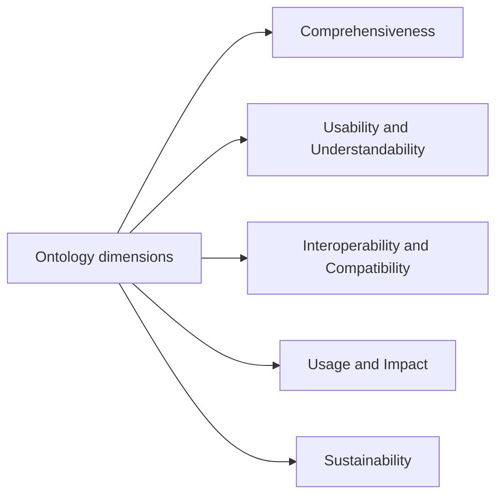

# Ontology

This page lists the evaluation dimensions and related entries for this resource family.

## Hierarchy diagram

## Overview

- [**Ontology dimensions**](#ontology-dimensions)
    - [**Comprehensiveness**](#comprehensiveness) — The extent to which the ontology can represent cultural heritage information in a sufficiently broad and appropriate way. This includes coverage of relevant asset types, entities, relationships, and properties across different cultural heritage domains and use cases.
    - [**Usability and Understandability**](#usability-and-understandability) — The extent to which the ontology can be understood, adopted, and applied effectively by stakeholders. This includes conceptual clarity, accessibility, quality of documentation, and practical usefulness.
    - [**Interoperability and Compatibility**](#interoperability-and-compatibility) — The extent to which the ontology can be integrated and used with other models, standards, and systems. This includes alignment with established data models, controlled vocabularies, and relevant standards, as well as technical compatibility through supported formats and interfaces.
    - [**Usage and Impact**](#usage-and-impact) — The extent to which the ontology is adopted, reused, and influential in cultural heritage research and practice, including its contribution to collaboration within the ECCCH ecosystem.
    - [**Sustainability**](#sustainability) — The extent to which the ontology can remain viable over time, including ease of maintenance, adaptability to new domains or standards, scalability, and the existence of appropriate governance and versioning practices.

### Ontology dimensions

- **Level:** 0
- **Display:** Ontology dimensions

#### Comprehensiveness

- **Level:** 1
- **Description:** The extent to which the ontology can represent cultural heritage information in a sufficiently broad and appropriate way. This includes coverage of relevant asset types, entities, relationships, and properties across different cultural heritage domains and use cases.
- **Display:** Comprehensiveness

#### Usability and Understandability

- **Level:** 1
- **Description:** The extent to which the ontology can be understood, adopted, and applied effectively by stakeholders. This includes conceptual clarity, accessibility, quality of documentation, and practical usefulness.
- **Display:** Usability and Understandability

#### Interoperability and Compatibility

- **Level:** 1
- **Description:** The extent to which the ontology can be integrated and used with other models, standards, and systems. This includes alignment with established data models, controlled vocabularies, and relevant standards, as well as technical compatibility through supported formats and interfaces.
- **Display:** Interoperability and Compatibility

#### Usage and Impact

- **Level:** 1
- **Description:** The extent to which the ontology is adopted, reused, and influential in cultural heritage research and practice, including its contribution to collaboration within the ECCCH ecosystem.
- **Display:** Usage and Impact

#### Sustainability

- **Level:** 1
- **Description:** The extent to which the ontology can remain viable over time, including ease of maintenance, adaptability to new domains or standards, scalability, and the existence of appropriate governance and versioning practices.
- **Display:** Sustainability
