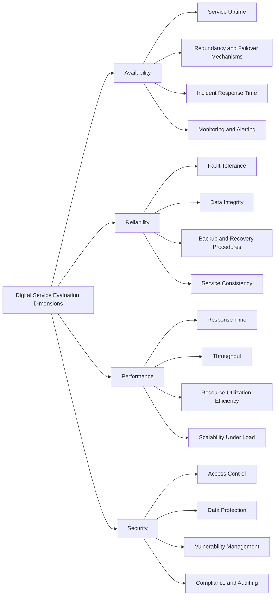

# Digital services

This page lists the evaluation dimensions and related entries for this resource family.

## Hierarchy diagram

## Overview

- [**Digital Service Evaluation Dimensions**](#digital-service-evaluation-dimensions)
    - [**Availability**](#availability) — This dimension assesses the extent to which the digital services are continuously operational and accessible, minimizing downtime and ensuring users can reliably access CH resources at any time.
        - [**Service Uptime**](#service-uptime) — Measures the proportion of time that the services remain fully operational and accessible to users.
        - [**Redundancy and Failover Mechanisms**](#redundancy-and-failover-mechanisms) — Assesses the presence and effectiveness of backup systems, load balancing, and failover strategies that ensure service continuity in case of component failure.
        - [**Incident Response Time**](#incident-response-time) — Evaluates how quickly the infrastructure team can detect, respond to, and resolve outages or service interruptions.
        - [**Monitoring and Alerting**](#monitoring-and-alerting) — Examines the robustness of monitoring systems and real-time alert mechanisms that track service health and performance.
    - [**Reliability**](#reliability) — This dimension evaluates the infrastructure’s ability to deliver consistent and dependable service performance under expected and peak workloads, avoiding system failures and data loss.
        - [**Fault Tolerance**](#fault-tolerance) — Assesses the infrastructure’s capacity to continue operating correctly even when components fail or experience errors.
        - [**Data Integrity**](#data-integrity) — Evaluates mechanisms ensuring that data remains accurate, complete, and consistent during storage, processing, and transmission.
        - [**Backup and Recovery Procedures**](#backup-and-recovery-procedures) — Measures the effectiveness and frequency of data backups and the ability to restore systems quickly after a failure or data loss.
        - [**Service Consistency**](#service-consistency) — Examines the ability of the infrastructure to provide predictable and stable service performance under varying workloads and operational conditions.
    - [**Performance**](#performance) — This dimension measures the responsiveness, speed, and efficiency of the infrastructure and its services in processing, storing, and retrieving CH data and metadata.
        - [**Response Time**](#response-time) — Measures how quickly the infrastructure and its services respond to user actions or data requests.
        - [**Throughput**](#throughput) — Evaluates the volume of operations, transactions, or data processed by the infrastructure within a given time period.
        - [**Resource Utilization Efficiency**](#resource-utilization-efficiency) — Assesses how effectively the system uses available computing resources (CPU, memory, storage, and network) to deliver optimal performance.
        - [**Scalability Under Load**](#scalability-under-load) — Examines the infrastructure’s ability to maintain or improve performance as the number of users, data volume, or computational demand increases.
    - [**Security**](#security) — This dimension evaluates the mechanisms protecting data, metadata, and services from unauthorized access, alteration, or loss, ensuring confidentiality, integrity, and compliance with relevant security standards.
        - [**Access Control**](#access-control) — Assesses the effectiveness of authentication and authorization mechanisms that manage and restrict user access to systems and data.
        - [**Data Protection**](#data-protection) — Evaluates the safeguards ensuring confidentiality, integrity, and availability of CH data during storage, transfer, and processing.
        - [**Vulnerability Management**](#vulnerability-management) — Measures the processes for identifying, assessing, and mitigating security risks, vulnerabilities, and potential threats within the infrastructure.
        - [**Compliance and Auditing**](#compliance-and-auditing) — Examines adherence to relevant security standards and regulations, and the implementation of regular audits to verify compliance and detect anomalies.

### Digital Service Evaluation Dimensions

- **Level:** 0
- **Display:** Digital Service Evaluation Dimensions

#### Availability

- **Level:** 1
- **Description:** This dimension assesses the extent to which the digital services are continuously operational and accessible, minimizing downtime and ensuring users can reliably access CH resources at any time.
- **Display:** Availability

##### Service Uptime

- **Level:** 2
- **Description:** Measures the proportion of time that the services remain fully operational and accessible to users.
- **Display:** Service Uptime

##### Redundancy and Failover Mechanisms

- **Level:** 2
- **Description:** Assesses the presence and effectiveness of backup systems, load balancing, and failover strategies that ensure service continuity in case of component failure.
- **Display:** Redundancy and Failover Mechanisms

##### Incident Response Time

- **Level:** 2
- **Description:** Evaluates how quickly the infrastructure team can detect, respond to, and resolve outages or service interruptions.
- **Display:** Incident Response Time

##### Monitoring and Alerting

- **Level:** 2
- **Description:** Examines the robustness of monitoring systems and real-time alert mechanisms that track service health and performance.
- **Display:** Monitoring and Alerting

#### Reliability

- **Level:** 1
- **Description:** This dimension evaluates the infrastructure’s ability to deliver consistent and dependable service performance under expected and peak workloads, avoiding system failures and data loss.
- **Display:** Reliability

##### Fault Tolerance

- **Level:** 2
- **Description:** Assesses the infrastructure’s capacity to continue operating correctly even when components fail or experience errors.
- **Display:** Fault Tolerance

##### Data Integrity

- **Level:** 2
- **Description:** Evaluates mechanisms ensuring that data remains accurate, complete, and consistent during storage, processing, and transmission.
- **Display:** Data Integrity

##### Backup and Recovery Procedures

- **Level:** 2
- **Description:** Measures the effectiveness and frequency of data backups and the ability to restore systems quickly after a failure or data loss.
- **Display:** Backup and Recovery Procedures

##### Service Consistency

- **Level:** 2
- **Description:** Examines the ability of the infrastructure to provide predictable and stable service performance under varying workloads and operational conditions.
- **Display:** Service Consistency

#### Performance

- **Level:** 1
- **Description:** This dimension measures the responsiveness, speed, and efficiency of the infrastructure and its services in processing, storing, and retrieving CH data and metadata.
- **Display:** Performance

##### Response Time

- **Level:** 2
- **Description:** Measures how quickly the infrastructure and its services respond to user actions or data requests.
- **Display:** Response Time

##### Throughput

- **Level:** 2
- **Description:** Evaluates the volume of operations, transactions, or data processed by the infrastructure within a given time period.
- **Display:** Throughput

##### Resource Utilization Efficiency

- **Level:** 2
- **Description:** Assesses how effectively the system uses available computing resources (CPU, memory, storage, and network) to deliver optimal performance.
- **Display:** Resource Utilization Efficiency

##### Scalability Under Load

- **Level:** 2
- **Description:** Examines the infrastructure’s ability to maintain or improve performance as the number of users, data volume, or computational demand increases.
- **Display:** Scalability Under Load

#### Security

- **Level:** 1
- **Description:** This dimension evaluates the mechanisms protecting data, metadata, and services from unauthorized access, alteration, or loss, ensuring confidentiality, integrity, and compliance with relevant security standards.
- **Display:** Security

##### Access Control

- **Level:** 2
- **Description:** Assesses the effectiveness of authentication and authorization mechanisms that manage and restrict user access to systems and data.
- **Display:** Access Control

##### Data Protection

- **Level:** 2
- **Description:** Evaluates the safeguards ensuring confidentiality, integrity, and availability of CH data during storage, transfer, and processing.
- **Display:** Data Protection

##### Vulnerability Management

- **Level:** 2
- **Description:** Measures the processes for identifying, assessing, and mitigating security risks, vulnerabilities, and potential threats within the infrastructure.
- **Display:** Vulnerability Management

##### Compliance and Auditing

- **Level:** 2
- **Description:** Examines adherence to relevant security standards and regulations, and the implementation of regular audits to verify compliance and detect anomalies.
- **Display:** Compliance and Auditing
