# Software

This page lists the evaluation dimensions and related entries for this resource family.

## Hierarchy diagram

```mermaid
flowchart LR
    software_dim_software_dimensions["Software dimensions"]
    software_dim_compatibility["Compatibility"]
    software_dim_software_dimensions --> software_dim_compatibility
    software_dim_co_existence["Co-existence"]
    software_dim_compatibility --> software_dim_co_existence
    software_dim_interoperability["Interoperability"]
    software_dim_compatibility --> software_dim_interoperability
    software_dim_fairness["FAIRness"]
    software_dim_software_dimensions --> software_dim_fairness
    software_dim_flexibility["Flexibility"]
    software_dim_software_dimensions --> software_dim_flexibility
    software_dim_adaptability["Adaptability"]
    software_dim_flexibility --> software_dim_adaptability
    software_dim_scalability["Scalability"]
    software_dim_flexibility --> software_dim_scalability
    software_dim_installability["Installability"]
    software_dim_flexibility --> software_dim_installability
    software_dim_replaceability["Replaceability"]
    software_dim_flexibility --> software_dim_replaceability
    software_dim_functional_suitability["Functional suitability"]
    software_dim_software_dimensions --> software_dim_functional_suitability
    software_dim_functional_completeness["Functional completeness"]
    software_dim_functional_suitability --> software_dim_functional_completeness
    software_dim_functional_correctness["Functional correctness"]
    software_dim_functional_suitability --> software_dim_functional_correctness
    software_dim_functional_appropriateness["Functional appropriateness"]
    software_dim_functional_suitability --> software_dim_functional_appropriateness
    software_dim_interaction_capability["Interaction Capability"]
    software_dim_software_dimensions --> software_dim_interaction_capability
    software_dim_appropriateness_recognizability["Appropriateness recognizability"]
    software_dim_interaction_capability --> software_dim_appropriateness_recognizability
    software_dim_learnability["Learnability"]
    software_dim_interaction_capability --> software_dim_learnability
    software_dim_operability["Operability"]
    software_dim_interaction_capability --> software_dim_operability
    software_dim_user_error_protection["User error protection"]
    software_dim_interaction_capability --> software_dim_user_error_protection
    software_dim_user_engagement["User engagement"]
    software_dim_interaction_capability --> software_dim_user_engagement
    software_dim_inclusivity["Inclusivity"]
    software_dim_interaction_capability --> software_dim_inclusivity
    software_dim_user_assistance["User assistance"]
    software_dim_interaction_capability --> software_dim_user_assistance
    software_dim_self_descriptiveness["Self-descriptiveness"]
    software_dim_interaction_capability --> software_dim_self_descriptiveness
    software_dim_maintainability["Maintainability"]
    software_dim_software_dimensions --> software_dim_maintainability
    software_dim_modularity["Modularity"]
    software_dim_maintainability --> software_dim_modularity
    software_dim_reusability["Reusability"]
    software_dim_maintainability --> software_dim_reusability
    software_dim_analysability["Analysability"]
    software_dim_maintainability --> software_dim_analysability
    software_dim_modifiability["Modifiability"]
    software_dim_maintainability --> software_dim_modifiability
    software_dim_testability["Testability"]
    software_dim_maintainability --> software_dim_testability
    software_dim_open_source_software["Open Source Software"]
    software_dim_software_dimensions --> software_dim_open_source_software
    software_dim_performance_efficiency["Performance Efficiency"]
    software_dim_software_dimensions --> software_dim_performance_efficiency
    software_dim_time_behaviour["Time behaviour"]
    software_dim_performance_efficiency --> software_dim_time_behaviour
    software_dim_resource_utilization["Resource utilization"]
    software_dim_performance_efficiency --> software_dim_resource_utilization
    software_dim_capacity["Capacity"]
    software_dim_performance_efficiency --> software_dim_capacity
    software_dim_reliability["Reliability"]
    software_dim_software_dimensions --> software_dim_reliability
    software_dim_faultlessness["Faultlessness"]
    software_dim_reliability --> software_dim_faultlessness
    software_dim_availability["Availability"]
    software_dim_reliability --> software_dim_availability
    software_dim_fault_tolerance["Fault tolerance"]
    software_dim_reliability --> software_dim_fault_tolerance
    software_dim_recoverability["Recoverability"]
    software_dim_reliability --> software_dim_recoverability
    software_dim_safety["Safety"]
    software_dim_software_dimensions --> software_dim_safety
    software_dim_operational_constraint["Operational constraint"]
    software_dim_safety --> software_dim_operational_constraint
    software_dim_risk_identification["Risk identification"]
    software_dim_safety --> software_dim_risk_identification
    software_dim_fail_safe["Fail safe"]
    software_dim_safety --> software_dim_fail_safe
    software_dim_hazard_warning["Hazard warning"]
    software_dim_safety --> software_dim_hazard_warning
    software_dim_safe_integration["Safe integration"]
    software_dim_safety --> software_dim_safe_integration
    software_dim_security["Security"]
    software_dim_software_dimensions --> software_dim_security
    software_dim_confidentiality["Confidentiality"]
    software_dim_security --> software_dim_confidentiality
    software_dim_integrity["Integrity"]
    software_dim_security --> software_dim_integrity
    software_dim_non_repudiation["Non-repudiation"]
    software_dim_security --> software_dim_non_repudiation
    software_dim_accountability["Accountability"]
    software_dim_security --> software_dim_accountability
    software_dim_authenticity["Authenticity"]
    software_dim_security --> software_dim_authenticity
    software_dim_resistance["Resistance"]
    software_dim_security --> software_dim_resistance
    software_dim_sustainability["Sustainability"]
    software_dim_software_dimensions --> software_dim_sustainability
    software_dim_usability["Usability"]
    software_dim_software_dimensions --> software_dim_usability
    software_dim_usefulness["Usefulness"]
    software_dim_usability --> software_dim_usefulness
    software_dim_efficiency_of_use["Efficiency of Use"]
    software_dim_usability --> software_dim_efficiency_of_use
    software_dim_ease_of_learning["Ease of Learning"]
    software_dim_usability --> software_dim_ease_of_learning
    software_dim_user_interface_quality["User Interface Quality"]
    software_dim_usability --> software_dim_user_interface_quality
    software_dim_documentation_quality["Documentation quality"]
    software_dim_usability --> software_dim_documentation_quality
    software_dim_compliance["Compliance"]
    software_dim_software_dimensions --> software_dim_compliance
    software_dim_access_management_for["Access Management for IPR"]
    software_dim_compliance --> software_dim_access_management_for
    software_dim_licensing_clarity["Licensing Clarity"]
    software_dim_compliance --> software_dim_licensing_clarity
    software_dim_data_quality_and["Data quality and Provenance"]
    software_dim_compliance --> software_dim_data_quality_and
    software_dim_data_governance_and["Data Governance and IPR enforcement"]
    software_dim_software_dimensions --> software_dim_data_governance_and
    software_dim_standard_adherence["Standard Adherence"]
    software_dim_data_governance_and --> software_dim_standard_adherence
    software_dim_regulatory_alignment["Regulatory Alignment"]
    software_dim_data_governance_and --> software_dim_regulatory_alignment
    software_dim_guideline_compliance["Guideline Compliance"]
    software_dim_data_governance_and --> software_dim_guideline_compliance
    software_dim_learning_value_for["Learning value for developers"]
    software_dim_software_dimensions --> software_dim_learning_value_for
    software_dim_developer_documentation_quality["Developer Documentation Quality"]
    software_dim_learning_value_for --> software_dim_developer_documentation_quality
    software_dim_training_resources_availability["Training Resources Availability"]
    software_dim_learning_value_for --> software_dim_training_resources_availability
    software_dim_community_support_and["Community Support and Collaboration"]
    software_dim_learning_value_for --> software_dim_community_support_and
    software_dim_user_adoption["User Adoption"]
    software_dim_software_dimensions --> software_dim_user_adoption
    software_dim_awareness_and_understanding["Awareness and Understanding"]
    software_dim_user_adoption --> software_dim_awareness_and_understanding
    software_dim_engagement_rate["Engagement Rate"]
    software_dim_user_adoption --> software_dim_engagement_rate
    software_dim_acceptance_rate["Acceptance Rate"]
    software_dim_user_adoption --> software_dim_acceptance_rate
    software_dim_training_effectiveness["Training Effectiveness"]
    software_dim_user_adoption --> software_dim_training_effectiveness
```

## Overview

- [**Software dimensions**](#software-dimensions) — Software.
    - [**Compatibility**](#compatibility) — Degree to which a product, system or component can exchange information with other products, systems or components, and/or perform its required functions while sharing the same common environment and resources.
        - [**Co-existence**](#co-existence) — Degree to which a product can perform its required functions efficiently while sharing a common environment and resources with other products, without detrimental impact on any other product.
        - [**Interoperability**](#interoperability) — Degree to which a system, product or component can exchange information with other products and mutually use the information that has been exchanged.
    - [**FAIRness**](#fairness) — Degree to which research software adheres to the FAIR principles: Findable, Accessible, Interoperable, and Reusable. These principles, adapted for research software, aim to enhance the discoverability, accessibility, interoperability, and reusability of software, thereby maximizing its value and impact in scientific research.
    - [**Flexibility**](#flexibility) — Degree to which a product can be adapted to changes in its requirements, contexts of use or system environment.
        - [**Adaptability**](#adaptability) — Degree to which a product or system can effectively and efficiently be adapted for or transferred to different hardware, software or other operational or usage environments.
        - [**Scalability**](#scalability) — Degree to which a product can handle growing or shrinking workloads or to adapt its capacity to handle variability.
        - [**Installability**](#installability) — Degree of effectiveness and efficiency with which a product or system can be successfully installed and/or uninstalled in a specified environment.
        - [**Replaceability**](#replaceability) — Degree to which a product can replace another specified software product for the same purpose in the same environment.
    - [**Functional suitability**](#functional-suitability) — This characteristic represents the degree to which a product or system provides functions that meet stated and implied needs when used under specified conditions.
        - [**Functional completeness**](#functional-completeness) — Degree to which the set of functions covers all the specified tasks and intended users’ objectives.
        - [**Functional correctness**](#functional-correctness) — Degree to which a product or system provides accurate results when used by intended users.
        - [**Functional appropriateness**](#functional-appropriateness) — Degree to which the functions facilitate the accomplishment of specified tasks and objectives.
    - [**Interaction Capability**](#interaction-capability) — Degree to which a product or system can be interacted with by specified users to exchange information via the user interface to complete specific tasks in a variety of contexts of use.
        - [**Appropriateness recognizability**](#appropriateness-recognizability) — Degree to which users can recognize whether a product or system is appropriate for their needs.
        - [**Learnability**](#learnability) — Degree to which the functions of a product or system can be learnt to be used by specified users within a specified amount of time.
        - [**Operability**](#operability) — Degree to which a product or system has attributes that make it easy to operate and control.
        - [**User error protection**](#user-error-protection) — Degree to which a system prevents users against operation errors.
        - [**User engagement**](#user-engagement) — Degree to which a user interface presents functions and information in an inviting and motivating manner encouraging continued interaction.
        - [**Inclusivity**](#inclusivity) — Degree to which a product or system can be used by people of various backgrounds (such as people of various ages, abilities, cultures, ethnicities, languages, genders, economic situations, etc.).
        - [**User assistance**](#user-assistance) — Degree to which a product can be used by people with the widest range of characteristics and capabilities to achieve specified goals in a specified context of use.
        - [**Self-descriptiveness**](#self-descriptiveness) — Degree to which a product presents appropriate information, where needed by the user, to make its capabilities and use immediately obvious to the user without excessive interactions with a product or other resources (such as user documentation, help desks or other users).
    - [**Maintainability**](#maintainability) — his characteristic represents the degree of effectiveness and efficiency with which a product or system can be modified to improve it, correct it or adapt it to changes in environment, and in requirements.
        - [**Modularity**](#modularity) — Degree to which a system or computer program is composed of discrete components such that a change to one component has minimal impact on other components.
        - [**Reusability**](#reusability) — Degree to which a product can be used as an asset in more than one system, or in building other assets.
        - [**Analysability**](#analysability) — Degree of effectiveness and efficiency with which it is possible to assess the impact on a product or system of an intended change to one or more of its parts, to diagnose a product for deficiencies or causes of failures, or to identify parts to be modified.
        - [**Modifiability**](#modifiability) — Degree to which a product or system can be effectively and efficiently modified without introducing defects or degrading existing product quality.
        - [**Testability**](#testability) — Degree of effectiveness and efficiency with which test criteria can be established for a system, product or component and tests can be performed to determine whether those criteria have been met.
    - [**Open Source Software**](#open-source-software) — Degree to which software source code is openly available for inspection, use, modification, and redistribution under an open licence. Open source software is software with source code that anyone can inspect, modify, and enhance. Research software can be published with or without open access to the source code. Open access to source code aligns better with academic research purposes than closed source software; open source software aligns with the FAIR4RS principles. It allows other researchers to directly verify the methods used to produce the results published in papers. It also makes reproducibility much easier. In addition to these research-driven reasons, publishing research software as open source software can help with long term maintenance in a cost-effective way, since interested developers can easily contribute new functionality or fix bugs. Moreover, by integrating with the greater open source ecosystem, researchers can leverage tools and support communities already available. As such, for most academic communities with limited resources, it is also a good choice from a software engineering perspective.
    - [**Performance Efficiency**](#performance-efficiency) — This characteristic represents the degree to which a product performs its functions within specified time and throughput parameters and is efficient in the use of resources (such as CPU, memory, storage, network devices, energy, materials…) under specified conditions.
        - [**Time behaviour**](#time-behaviour) — Degree to which the response time and throughput rates of a product or system, when performing its functions, meet requirements.
        - [**Resource utilization**](#resource-utilization) — Degree to which the amounts and types of resources used by a product or system, when performing its functions, meet requirements.
        - [**Capacity**](#capacity) — Degree to which the maximum limits of a product or system parameter meet requirements.
    - [**Reliability**](#reliability) — Degree to which a system, product or component performs specified functions under specified conditions for a specified period of time.
        - [**Faultlessness**](#faultlessness) — Degree to which a system, product or component performs specified functions without fault under normal operation.
        - [**Availability**](#availability) — Degree to which a system, product or component is operational and accessible when required for use.
        - [**Fault tolerance**](#fault-tolerance) — Degree to which a system, product or component operates as intended despite the presence of hardware or software faults.
        - [**Recoverability**](#recoverability) — Degree to which, in the event of an interruption or a failure, a product or system can recover the data directly affected and re-establish the desired state of the system.
    - [**Safety**](#safety) — This characteristic represents the degree to which a product under defined conditions avoids a state in which human life, health, property, or the environment is endangered.
        - [**Operational constraint**](#operational-constraint) — Degree to which a product or system constrains its operation to within safe parameters or states when encountering operational hazard.
        - [**Risk identification**](#risk-identification) — Degree to which a product can identify a course of events or operations that can expose life, property or environment to unacceptable risk.
        - [**Fail safe**](#fail-safe) — Degree to which a product can automatically place itself in a safe operating mode, or to revert to a safe condition in the event of a failure.
        - [**Hazard warning**](#hazard-warning) — Degree to which a product or system provides warnings of unacceptable risks to operations or internal controls so that they can react in sufficient time to sustain safe operations.
        - [**Safe integration**](#safe-integration) — Degree to which a product can maintain safety during and after integration with one or more components.
    - [**Security**](#security) — Degree to which a product or system defends against attack patterns by malicious actors and protects information and data so that persons or other products or systems have the degree of data access appropriate to their types and levels of authorization.
        - [**Confidentiality**](#confidentiality) — Degree to which a product or system ensures that data are accessible only to those authorized to have access.
        - [**Integrity**](#integrity) — Degree to which a system, product or component ensures that the state of its system and data are protected from unauthorized modification or deletion either by malicious action or computer error.
        - [**Non-repudiation**](#non-repudiation) — Degree to which actions or events can be proven to have taken place so that the events or actions cannot be repudiated later.
        - [**Accountability**](#accountability) — Degree to which the actions of an entity can be traced uniquely to the entity.
        - [**Authenticity**](#authenticity) — Degree to which the identity of a subject or resource can be proved to be the one claimed.
        - [**Resistance**](#resistance) — Degree to which the product or system sustains operations while under attack from a malicious actor.
    - [**Sustainability**](#sustainability) — Degree to which software can continue to exist, be maintained, and remain useful over time across changing platforms, dependencies, and user needs.
    - [**Usability**](#usability) — This dimension refers to how easy, efficient, and satisfactory the ECCCH applications and tools are for their intended users.
        - [**Usefulness**](#usefulness) — Measures the extent to which the application effectively addresses the specific needs and goals of CH professionals.
        - [**Efficiency of Use**](#efficiency-of-use) — Measures how quickly and effectively experienced users can accomplish tasks with the tools.
        - [**Ease of Learning**](#ease-of-learning) — Indicates how quickly new users can understand and effectively operate the application.
        - [**User Interface Quality**](#user-interface-quality) — Assesses the intuitiveness, consistency, and visual clarity of the application's design and layout.
        - [**Documentation quality**](#documentation-quality) — Evaluates the clarity, comprehensiveness, and accessibility of user guides, tutorials, FAQs, and other support materials about the application.
    - [**Compliance**](#compliance) — This dimension evaluates the adherence of the application to established standards, regulations, and project-specific guidelines. Subdimensions are very preliminar.
        - [**Access Management for IPR**](#access-management-for-ipr) — Evaluates the effectiveness of the application in managing and restricting access based on intellectual propert.
        - [**Licensing Clarity**](#licensing-clarity) — Measures the application's ability to enforce explicit licensing terms for all data.
        - [**Data quality and Provenance**](#data-quality-and-provenance) — Measures the application's ability to ensure data quality, consistency, and clear traceability of its origin and modifications.
    - [**Data Governance and IPR enforcement**](#data-governance-and-ipr-enforcement) — This dimension focuses on how the application facilitates or enforces the data governance model and the preservation of intellectual property rights.
        - [**Standard Adherence**](#standard-adherence) — Assesses conformity with relevant technical standards, data formats, and open models.
        - [**Regulatory Alignment**](#regulatory-alignment) — Measures compliance with national, European, and international legal and ethical frameworks.
        - [**Guideline Compliance**](#guideline-compliance) — Ensures adherence to specific integration, development, and communication guidelines provided by the ECHOES consortium.
    - [**Learning value for developers**](#learning-value-for-developers) — This dimension considers how well the application supports and educates developers willing to contribute with their own applications.
        - [**Developer Documentation Quality**](#developer-documentation-quality) — Assesses the clarity, comprehensiveness, and utility of technical documentation tailored for developers, including examples and guidelines.
        - [**Training Resources Availability**](#training-resources-availability) — Evaluates the provision of educational materials, tutorials, and capacity-building activities specifically for developers to enhance their skills.
        - [**Community Support and Collaboration**](#community-support-and-collaboration) — Measures the effectiveness of mechanisms that facilitate knowledge exchange, problem-solving, and collaborative development among the developer community regarding a specific application.
    - [**User Adoption**](#user-adoption) — This dimension measures the extent to which CH stakeholders embrace and effectively use a specific application.
        - [**Awareness and Understanding**](#awareness-and-understanding) — Reflects how well target communities are informed about and comprehend the advantages of using a specific ECCCH application.
        - [**Engagement Rate**](#engagement-rate) — Indicates the frequency and depth of active use of the application by users (active users, session duration...).
        - [**Acceptance Rate**](#acceptance-rate) — Measures the overall willingness and readiness of the community to integrate and use a specific application in their workflows.
        - [**Training Effectiveness**](#training-effectiveness) — Evaluates the success of capacity-building activities and the ECHOES curriculum in equipping users with the necessary skills for using the application.

### Software dimensions

- **Level:** 0
- **Description:** Software.
- **Display:** Software dimensions

#### Compatibility

- **Level:** 1
- **Description:** Degree to which a product, system or component can exchange information with other products, systems or components, and/or perform its required functions while sharing the same common environment and resources.
- **Display:** Compatibility
- **Source Name:** ISO/IEC 25010 standard
- **Source Url:** <a href="https://iso25000.com/index.php/en/iso-25000-standards/iso-25010" target="_blank" rel="noopener noreferrer">https://iso25000.com/index.php/en/iso-25000-standards/iso-25010</a>
- **Notes:** Addopted from <a href="https://github.com/EVERSE-ResearchSoftware/RSQKit" target="_blank" rel="noopener noreferrer">https://github.com/EVERSE-ResearchSoftware/RSQKit</a>

##### Co-existence

- **Level:** 2
- **Description:** Degree to which a product can perform its required functions efficiently while sharing a common environment and resources with other products, without detrimental impact on any other product.
- **Display:** Co-existence
- **Source Name:** ISO/IEC 25010 standard
- **Source Url:** <a href="https://iso25000.com/index.php/en/iso-25000-standards/iso-25011" target="_blank" rel="noopener noreferrer">https://iso25000.com/index.php/en/iso-25000-standards/iso-25011</a>

##### Interoperability

- **Level:** 2
- **Description:** Degree to which a system, product or component can exchange information with other products and mutually use the information that has been exchanged.
- **Display:** Interoperability
- **Source Name:** ISO/IEC 25010 standard
- **Source Url:** <a href="https://iso25000.com/index.php/en/iso-25000-standards/iso-25012" target="_blank" rel="noopener noreferrer">https://iso25000.com/index.php/en/iso-25000-standards/iso-25012</a>

#### FAIRness

- **Level:** 1
- **Description:** Degree to which research software adheres to the FAIR principles: Findable, Accessible, Interoperable, and Reusable. These principles, adapted for research software, aim to enhance the discoverability, accessibility, interoperability, and reusability of software, thereby maximizing its value and impact in scientific research.
- **Display:** FAIRness
- **Source Name:** Introducing the FAIR Principles for research software
- **Source Url:** <a href="https://www.nature.com/articles/s41597-022-01710-x" target="_blank" rel="noopener noreferrer">https://www.nature.com/articles/s41597-022-01710-x</a>

#### Flexibility

- **Level:** 1
- **Description:** Degree to which a product can be adapted to changes in its requirements, contexts of use or system environment.
- **Display:** Flexibility
- **Source Name:** ISO/IEC 25010 standard
- **Source Url:** <a href="https://iso25000.com/index.php/en/iso-25000-standards/iso-25010" target="_blank" rel="noopener noreferrer">https://iso25000.com/index.php/en/iso-25000-standards/iso-25010</a>

##### Adaptability

- **Level:** 2
- **Description:** Degree to which a product or system can effectively and efficiently be adapted for or transferred to different hardware, software or other operational or usage environments.
- **Display:** Adaptability
- **Source Name:** ISO/IEC 25010 standard
- **Source Url:** <a href="https://iso25000.com/index.php/en/iso-25000-standards/iso-25011" target="_blank" rel="noopener noreferrer">https://iso25000.com/index.php/en/iso-25000-standards/iso-25011</a>

##### Scalability

- **Level:** 2
- **Description:** Degree to which a product can handle growing or shrinking workloads or to adapt its capacity to handle variability.
- **Display:** Scalability
- **Source Name:** ISO/IEC 25010 standard
- **Source Url:** <a href="https://iso25000.com/index.php/en/iso-25000-standards/iso-25012" target="_blank" rel="noopener noreferrer">https://iso25000.com/index.php/en/iso-25000-standards/iso-25012</a>

##### Installability

- **Level:** 2
- **Description:** Degree of effectiveness and efficiency with which a product or system can be successfully installed and/or uninstalled in a specified environment.
- **Display:** Installability
- **Source Name:** ISO/IEC 25010 standard
- **Source Url:** <a href="https://iso25000.com/index.php/en/iso-25000-standards/iso-25013" target="_blank" rel="noopener noreferrer">https://iso25000.com/index.php/en/iso-25000-standards/iso-25013</a>

##### Replaceability

- **Level:** 2
- **Description:** Degree to which a product can replace another specified software product for the same purpose in the same environment.
- **Display:** Replaceability
- **Source Name:** ISO/IEC 25010 standard
- **Source Url:** <a href="https://iso25000.com/index.php/en/iso-25000-standards/iso-25014" target="_blank" rel="noopener noreferrer">https://iso25000.com/index.php/en/iso-25000-standards/iso-25014</a>

#### Functional suitability

- **Level:** 1
- **Description:** This characteristic represents the degree to which a product or system provides functions that meet stated and implied needs when used under specified conditions.
- **Display:** Functional suitability
- **Source Name:** ISO/IEC 25010 standard
- **Source Url:** <a href="https://iso25000.com/index.php/en/iso-25000-standards/iso-25010" target="_blank" rel="noopener noreferrer">https://iso25000.com/index.php/en/iso-25000-standards/iso-25010</a>

##### Functional completeness

- **Level:** 2
- **Description:** Degree to which the set of functions covers all the specified tasks and intended users’ objectives.
- **Display:** Functional completeness
- **Source Name:** ISO/IEC 25010 standard
- **Source Url:** <a href="https://iso25000.com/index.php/en/iso-25000-standards/iso-25011" target="_blank" rel="noopener noreferrer">https://iso25000.com/index.php/en/iso-25000-standards/iso-25011</a>

##### Functional correctness

- **Level:** 2
- **Description:** Degree to which a product or system provides accurate results when used by intended users.
- **Display:** Functional correctness
- **Source Name:** ISO/IEC 25010 standard
- **Source Url:** <a href="https://iso25000.com/index.php/en/iso-25000-standards/iso-25012" target="_blank" rel="noopener noreferrer">https://iso25000.com/index.php/en/iso-25000-standards/iso-25012</a>

##### Functional appropriateness

- **Level:** 2
- **Description:** Degree to which the functions facilitate the accomplishment of specified tasks and objectives.
- **Display:** Functional appropriateness
- **Source Name:** ISO/IEC 25010 standard
- **Source Url:** <a href="https://iso25000.com/index.php/en/iso-25000-standards/iso-25013" target="_blank" rel="noopener noreferrer">https://iso25000.com/index.php/en/iso-25000-standards/iso-25013</a>

#### Interaction Capability

- **Level:** 1
- **Description:** Degree to which a product or system can be interacted with by specified users to exchange information via the user interface to complete specific tasks in a variety of contexts of use.
- **Display:** Interaction Capability
- **Source Name:** ISO/IEC 25010 standard
- **Source Url:** <a href="https://iso25000.com/index.php/en/iso-25000-standards/iso-25010" target="_blank" rel="noopener noreferrer">https://iso25000.com/index.php/en/iso-25000-standards/iso-25010</a>

##### Appropriateness recognizability

- **Level:** 2
- **Description:** Degree to which users can recognize whether a product or system is appropriate for their needs.
- **Display:** Appropriateness recognizability
- **Source Name:** ISO/IEC 25010 standard
- **Source Url:** <a href="https://iso25000.com/index.php/en/iso-25000-standards/iso-25011" target="_blank" rel="noopener noreferrer">https://iso25000.com/index.php/en/iso-25000-standards/iso-25011</a>

##### Learnability

- **Level:** 2
- **Description:** Degree to which the functions of a product or system can be learnt to be used by specified users within a specified amount of time.
- **Display:** Learnability
- **Source Name:** ISO/IEC 25010 standard
- **Source Url:** <a href="https://iso25000.com/index.php/en/iso-25000-standards/iso-25012" target="_blank" rel="noopener noreferrer">https://iso25000.com/index.php/en/iso-25000-standards/iso-25012</a>

##### Operability

- **Level:** 2
- **Description:** Degree to which a product or system has attributes that make it easy to operate and control.
- **Display:** Operability
- **Source Name:** ISO/IEC 25010 standard
- **Source Url:** <a href="https://iso25000.com/index.php/en/iso-25000-standards/iso-25013" target="_blank" rel="noopener noreferrer">https://iso25000.com/index.php/en/iso-25000-standards/iso-25013</a>

##### User error protection

- **Level:** 2
- **Description:** Degree to which a system prevents users against operation errors.
- **Display:** User error protection
- **Source Name:** ISO/IEC 25010 standard
- **Source Url:** <a href="https://iso25000.com/index.php/en/iso-25000-standards/iso-25014" target="_blank" rel="noopener noreferrer">https://iso25000.com/index.php/en/iso-25000-standards/iso-25014</a>

##### User engagement

- **Level:** 2
- **Description:** Degree to which a user interface presents functions and information in an inviting and motivating manner encouraging continued interaction.
- **Display:** User engagement
- **Source Name:** ISO/IEC 25010 standard
- **Source Url:** <a href="https://iso25000.com/index.php/en/iso-25000-standards/iso-25015" target="_blank" rel="noopener noreferrer">https://iso25000.com/index.php/en/iso-25000-standards/iso-25015</a>

##### Inclusivity

- **Level:** 2
- **Description:** Degree to which a product or system can be used by people of various backgrounds (such as people of various ages, abilities, cultures, ethnicities, languages, genders, economic situations, etc.).
- **Display:** Inclusivity
- **Source Name:** ISO/IEC 25010 standard
- **Source Url:** <a href="https://iso25000.com/index.php/en/iso-25000-standards/iso-25016" target="_blank" rel="noopener noreferrer">https://iso25000.com/index.php/en/iso-25000-standards/iso-25016</a>

##### User assistance

- **Level:** 2
- **Description:** Degree to which a product can be used by people with the widest range of characteristics and capabilities to achieve specified goals in a specified context of use.
- **Display:** User assistance
- **Source Name:** ISO/IEC 25010 standard
- **Source Url:** <a href="https://iso25000.com/index.php/en/iso-25000-standards/iso-25017" target="_blank" rel="noopener noreferrer">https://iso25000.com/index.php/en/iso-25000-standards/iso-25017</a>

##### Self-descriptiveness

- **Level:** 2
- **Description:** Degree to which a product presents appropriate information, where needed by the user, to make its capabilities and use immediately obvious to the user without excessive interactions with a product or other resources (such as user documentation, help desks or other users).
- **Display:** Self-descriptiveness
- **Source Name:** ISO/IEC 25010 standard
- **Source Url:** <a href="https://iso25000.com/index.php/en/iso-25000-standards/iso-25018" target="_blank" rel="noopener noreferrer">https://iso25000.com/index.php/en/iso-25000-standards/iso-25018</a>

#### Maintainability

- **Level:** 1
- **Description:** his characteristic represents the degree of effectiveness and efficiency with which a product or system can be modified to improve it, correct it or adapt it to changes in environment, and in requirements.
- **Display:** Maintainability
- **Source Name:** ISO/IEC 25010 standard
- **Source Url:** <a href="https://iso25000.com/index.php/en/iso-25000-standards/iso-25010" target="_blank" rel="noopener noreferrer">https://iso25000.com/index.php/en/iso-25000-standards/iso-25010</a>

##### Modularity

- **Level:** 2
- **Description:** Degree to which a system or computer program is composed of discrete components such that a change to one component has minimal impact on other components.
- **Display:** Modularity
- **Source Name:** ISO/IEC 25010 standard
- **Source Url:** <a href="https://iso25000.com/index.php/en/iso-25000-standards/iso-25011" target="_blank" rel="noopener noreferrer">https://iso25000.com/index.php/en/iso-25000-standards/iso-25011</a>

##### Reusability

- **Level:** 2
- **Description:** Degree to which a product can be used as an asset in more than one system, or in building other assets.
- **Display:** Reusability
- **Source Name:** ISO/IEC 25010 standard
- **Source Url:** <a href="https://iso25000.com/index.php/en/iso-25000-standards/iso-25012" target="_blank" rel="noopener noreferrer">https://iso25000.com/index.php/en/iso-25000-standards/iso-25012</a>

##### Analysability

- **Level:** 2
- **Description:** Degree of effectiveness and efficiency with which it is possible to assess the impact on a product or system of an intended change to one or more of its parts, to diagnose a product for deficiencies or causes of failures, or to identify parts to be modified.
- **Display:** Analysability
- **Source Name:** ISO/IEC 25010 standard
- **Source Url:** <a href="https://iso25000.com/index.php/en/iso-25000-standards/iso-25013" target="_blank" rel="noopener noreferrer">https://iso25000.com/index.php/en/iso-25000-standards/iso-25013</a>

##### Modifiability

- **Level:** 2
- **Description:** Degree to which a product or system can be effectively and efficiently modified without introducing defects or degrading existing product quality.
- **Display:** Modifiability
- **Source Name:** ISO/IEC 25010 standard
- **Source Url:** <a href="https://iso25000.com/index.php/en/iso-25000-standards/iso-25014" target="_blank" rel="noopener noreferrer">https://iso25000.com/index.php/en/iso-25000-standards/iso-25014</a>

##### Testability

- **Level:** 2
- **Description:** Degree of effectiveness and efficiency with which test criteria can be established for a system, product or component and tests can be performed to determine whether those criteria have been met.
- **Display:** Testability
- **Source Name:** ISO/IEC 25010 standard
- **Source Url:** <a href="https://iso25000.com/index.php/en/iso-25000-standards/iso-25015" target="_blank" rel="noopener noreferrer">https://iso25000.com/index.php/en/iso-25000-standards/iso-25015</a>

#### Open Source Software

- **Level:** 1
- **Description:** Degree to which software source code is openly available for inspection, use, modification, and redistribution under an open licence. Open source software is software with source code that anyone can inspect, modify, and enhance. Research software can be published with or without open access to the source code. Open access to source code aligns better with academic research purposes than closed source software; open source software aligns with the FAIR4RS principles. It allows other researchers to directly verify the methods used to produce the results published in papers. It also makes reproducibility much easier. In addition to these research-driven reasons, publishing research software as open source software can help with long term maintenance in a cost-effective way, since interested developers can easily contribute new functionality or fix bugs. Moreover, by integrating with the greater open source ecosystem, researchers can leverage tools and support communities already available. As such, for most academic communities with limited resources, it is also a good choice from a software engineering perspective.
- **Display:** Open Source Software
- **Source Name:** EVERSE Reference Framework
- **Source Url:** <a href="https://doi.org/10.5281/zenodo.14204478" target="_blank" rel="noopener noreferrer">https://doi.org/10.5281/zenodo.14204478</a>

#### Performance Efficiency

- **Level:** 1
- **Description:** This characteristic represents the degree to which a product performs its functions within specified time and throughput parameters and is efficient in the use of resources (such as CPU, memory, storage, network devices, energy, materials…) under specified conditions.
- **Display:** Performance Efficiency
- **Source Name:** ISO/IEC 25010 standard
- **Source Url:** <a href="https://iso25000.com/index.php/en/iso-25000-standards/iso-25010" target="_blank" rel="noopener noreferrer">https://iso25000.com/index.php/en/iso-25000-standards/iso-25010</a>

##### Time behaviour

- **Level:** 2
- **Description:** Degree to which the response time and throughput rates of a product or system, when performing its functions, meet requirements.
- **Display:** Time behaviour
- **Source Name:** ISO/IEC 25010 standard
- **Source Url:** <a href="https://iso25000.com/index.php/en/iso-25000-standards/iso-25011" target="_blank" rel="noopener noreferrer">https://iso25000.com/index.php/en/iso-25000-standards/iso-25011</a>

##### Resource utilization

- **Level:** 2
- **Description:** Degree to which the amounts and types of resources used by a product or system, when performing its functions, meet requirements.
- **Display:** Resource utilization
- **Source Name:** ISO/IEC 25010 standard
- **Source Url:** <a href="https://iso25000.com/index.php/en/iso-25000-standards/iso-25012" target="_blank" rel="noopener noreferrer">https://iso25000.com/index.php/en/iso-25000-standards/iso-25012</a>

##### Capacity

- **Level:** 2
- **Description:** Degree to which the maximum limits of a product or system parameter meet requirements.
- **Display:** Capacity
- **Source Name:** ISO/IEC 25010 standard
- **Source Url:** <a href="https://iso25000.com/index.php/en/iso-25000-standards/iso-25013" target="_blank" rel="noopener noreferrer">https://iso25000.com/index.php/en/iso-25000-standards/iso-25013</a>

#### Reliability

- **Level:** 1
- **Description:** Degree to which a system, product or component performs specified functions under specified conditions for a specified period of time.
- **Display:** Reliability
- **Source Name:** ISO/IEC 25010 standard
- **Source Url:** <a href="https://iso25000.com/index.php/en/iso-25000-standards/iso-25010" target="_blank" rel="noopener noreferrer">https://iso25000.com/index.php/en/iso-25000-standards/iso-25010</a>

##### Faultlessness

- **Level:** 2
- **Description:** Degree to which a system, product or component performs specified functions without fault under normal operation.
- **Display:** Faultlessness
- **Source Name:** ISO/IEC 25010 standard
- **Source Url:** <a href="https://iso25000.com/index.php/en/iso-25000-standards/iso-25011" target="_blank" rel="noopener noreferrer">https://iso25000.com/index.php/en/iso-25000-standards/iso-25011</a>

##### Availability

- **Level:** 2
- **Description:** Degree to which a system, product or component is operational and accessible when required for use.
- **Display:** Availability
- **Source Name:** ISO/IEC 25010 standard
- **Source Url:** <a href="https://iso25000.com/index.php/en/iso-25000-standards/iso-25012" target="_blank" rel="noopener noreferrer">https://iso25000.com/index.php/en/iso-25000-standards/iso-25012</a>

##### Fault tolerance

- **Level:** 2
- **Description:** Degree to which a system, product or component operates as intended despite the presence of hardware or software faults.
- **Display:** Fault tolerance
- **Source Name:** ISO/IEC 25010 standard
- **Source Url:** <a href="https://iso25000.com/index.php/en/iso-25000-standards/iso-25013" target="_blank" rel="noopener noreferrer">https://iso25000.com/index.php/en/iso-25000-standards/iso-25013</a>

##### Recoverability

- **Level:** 2
- **Description:** Degree to which, in the event of an interruption or a failure, a product or system can recover the data directly affected and re-establish the desired state of the system.
- **Display:** Recoverability
- **Source Name:** ISO/IEC 25010 standard
- **Source Url:** <a href="https://iso25000.com/index.php/en/iso-25000-standards/iso-25014" target="_blank" rel="noopener noreferrer">https://iso25000.com/index.php/en/iso-25000-standards/iso-25014</a>

#### Safety

- **Level:** 1
- **Description:** This characteristic represents the degree to which a product under defined conditions avoids a state in which human life, health, property, or the environment is endangered.
- **Display:** Safety
- **Source Name:** ISO/IEC 25010 standard
- **Source Url:** <a href="https://iso25000.com/index.php/en/iso-25000-standards/iso-25010" target="_blank" rel="noopener noreferrer">https://iso25000.com/index.php/en/iso-25000-standards/iso-25010</a>

##### Operational constraint

- **Level:** 2
- **Description:** Degree to which a product or system constrains its operation to within safe parameters or states when encountering operational hazard.
- **Display:** Operational constraint
- **Source Name:** ISO/IEC 25010 standard
- **Source Url:** <a href="https://iso25000.com/index.php/en/iso-25000-standards/iso-25011" target="_blank" rel="noopener noreferrer">https://iso25000.com/index.php/en/iso-25000-standards/iso-25011</a>

##### Risk identification

- **Level:** 2
- **Description:** Degree to which a product can identify a course of events or operations that can expose life, property or environment to unacceptable risk.
- **Display:** Risk identification
- **Source Name:** ISO/IEC 25010 standard
- **Source Url:** <a href="https://iso25000.com/index.php/en/iso-25000-standards/iso-25012" target="_blank" rel="noopener noreferrer">https://iso25000.com/index.php/en/iso-25000-standards/iso-25012</a>

##### Fail safe

- **Level:** 2
- **Description:** Degree to which a product can automatically place itself in a safe operating mode, or to revert to a safe condition in the event of a failure.
- **Display:** Fail safe
- **Source Name:** ISO/IEC 25010 standard
- **Source Url:** <a href="https://iso25000.com/index.php/en/iso-25000-standards/iso-25013" target="_blank" rel="noopener noreferrer">https://iso25000.com/index.php/en/iso-25000-standards/iso-25013</a>

##### Hazard warning

- **Level:** 2
- **Description:** Degree to which a product or system provides warnings of unacceptable risks to operations or internal controls so that they can react in sufficient time to sustain safe operations.
- **Display:** Hazard warning
- **Source Name:** ISO/IEC 25010 standard
- **Source Url:** <a href="https://iso25000.com/index.php/en/iso-25000-standards/iso-25014" target="_blank" rel="noopener noreferrer">https://iso25000.com/index.php/en/iso-25000-standards/iso-25014</a>

##### Safe integration

- **Level:** 2
- **Description:** Degree to which a product can maintain safety during and after integration with one or more components.
- **Display:** Safe integration
- **Source Name:** ISO/IEC 25010 standard
- **Source Url:** <a href="https://iso25000.com/index.php/en/iso-25000-standards/iso-25015" target="_blank" rel="noopener noreferrer">https://iso25000.com/index.php/en/iso-25000-standards/iso-25015</a>

#### Security

- **Level:** 1
- **Description:** Degree to which a product or system defends against attack patterns by malicious actors and protects information and data so that persons or other products or systems have the degree of data access appropriate to their types and levels of authorization.
- **Display:** Security
- **Source Name:** ISO/IEC 25010 standard
- **Source Url:** <a href="https://iso25000.com/index.php/en/iso-25000-standards/iso-25010" target="_blank" rel="noopener noreferrer">https://iso25000.com/index.php/en/iso-25000-standards/iso-25010</a>

##### Confidentiality

- **Level:** 2
- **Description:** Degree to which a product or system ensures that data are accessible only to those authorized to have access.
- **Display:** Confidentiality
- **Source Name:** ISO/IEC 25010 standard
- **Source Url:** <a href="https://iso25000.com/index.php/en/iso-25000-standards/iso-25011" target="_blank" rel="noopener noreferrer">https://iso25000.com/index.php/en/iso-25000-standards/iso-25011</a>

##### Integrity

- **Level:** 2
- **Description:** Degree to which a system, product or component ensures that the state of its system and data are protected from unauthorized modification or deletion either by malicious action or computer error.
- **Display:** Integrity
- **Source Name:** ISO/IEC 25010 standard
- **Source Url:** <a href="https://iso25000.com/index.php/en/iso-25000-standards/iso-25012" target="_blank" rel="noopener noreferrer">https://iso25000.com/index.php/en/iso-25000-standards/iso-25012</a>

##### Non-repudiation

- **Level:** 2
- **Description:** Degree to which actions or events can be proven to have taken place so that the events or actions cannot be repudiated later.
- **Display:** Non-repudiation
- **Source Name:** ISO/IEC 25010 standard
- **Source Url:** <a href="https://iso25000.com/index.php/en/iso-25000-standards/iso-25013" target="_blank" rel="noopener noreferrer">https://iso25000.com/index.php/en/iso-25000-standards/iso-25013</a>

##### Accountability

- **Level:** 2
- **Description:** Degree to which the actions of an entity can be traced uniquely to the entity.
- **Display:** Accountability
- **Source Name:** ISO/IEC 25010 standard
- **Source Url:** <a href="https://iso25000.com/index.php/en/iso-25000-standards/iso-25014" target="_blank" rel="noopener noreferrer">https://iso25000.com/index.php/en/iso-25000-standards/iso-25014</a>

##### Authenticity

- **Level:** 2
- **Description:** Degree to which the identity of a subject or resource can be proved to be the one claimed.
- **Display:** Authenticity
- **Source Name:** ISO/IEC 25010 standard
- **Source Url:** <a href="https://iso25000.com/index.php/en/iso-25000-standards/iso-25015" target="_blank" rel="noopener noreferrer">https://iso25000.com/index.php/en/iso-25000-standards/iso-25015</a>

##### Resistance

- **Level:** 2
- **Description:** Degree to which the product or system sustains operations while under attack from a malicious actor.
- **Display:** Resistance
- **Source Name:** ISO/IEC 25010 standard
- **Source Url:** <a href="https://iso25000.com/index.php/en/iso-25000-standards/iso-25016" target="_blank" rel="noopener noreferrer">https://iso25000.com/index.php/en/iso-25000-standards/iso-25016</a>

#### Sustainability

- **Level:** 1
- **Description:** Degree to which software can continue to exist, be maintained, and remain useful over time across changing platforms, dependencies, and user needs.
- **Display:** Sustainability
- **Source Name:** Defining Software Sustainability
- **Source Url:** <a href="https://danielskatzblog.wordpress.com/2016/09/13/defining-software-sustainability/" target="_blank" rel="noopener noreferrer">https://danielskatzblog.wordpress.com/2016/09/13/defining-software-sustainability/</a>

#### Usability

- **Level:** 1
- **Description:** This dimension refers to how easy, efficient, and satisfactory the ECCCH applications and tools are for their intended users.
- **Display:** Usability
- **Source Name:** ECHOES

##### Usefulness

- **Level:** 2
- **Description:** Measures the extent to which the application effectively addresses the specific needs and goals of CH professionals.
- **Display:** Usefulness
- **Source Name:** ECHOES

##### Efficiency of Use

- **Level:** 2
- **Description:** Measures how quickly and effectively experienced users can accomplish tasks with the tools.
- **Display:** Efficiency of Use
- **Source Name:** ECHOES

##### Ease of Learning

- **Level:** 2
- **Description:** Indicates how quickly new users can understand and effectively operate the application.
- **Display:** Ease of Learning
- **Source Name:** ECHOES

##### User Interface Quality

- **Level:** 2
- **Description:** Assesses the intuitiveness, consistency, and visual clarity of the application's design and layout.
- **Display:** User Interface Quality
- **Source Name:** ECHOES

##### Documentation quality

- **Level:** 2
- **Description:** Evaluates the clarity, comprehensiveness, and accessibility of user guides, tutorials, FAQs, and other support materials about the application.
- **Display:** Documentation quality
- **Source Name:** ECHOES

#### Compliance

- **Level:** 1
- **Description:** This dimension evaluates the adherence of the application to established standards, regulations, and project-specific guidelines. Subdimensions are very preliminar.
- **Display:** Compliance
- **Source Name:** ECHOES

##### Access Management for IPR

- **Level:** 2
- **Description:** Evaluates the effectiveness of the application in managing and restricting access based on intellectual propert.
- **Display:** Access Management for IPR
- **Source Name:** ECHOES

##### Licensing Clarity

- **Level:** 2
- **Description:** Measures the application's ability to enforce explicit licensing terms for all data.
- **Display:** Licensing Clarity
- **Source Name:** ECHOES

##### Data quality and Provenance

- **Level:** 2
- **Description:** Measures the application's ability to ensure data quality, consistency, and clear traceability of its origin and modifications.
- **Display:** Data quality and Provenance
- **Source Name:** ECHOES

#### Data Governance and IPR enforcement

- **Level:** 1
- **Description:** This dimension focuses on how the application facilitates or enforces the data governance model and the preservation of intellectual property rights.
- **Display:** Data Governance and IPR enforcement
- **Source Name:** ECHOES

##### Standard Adherence

- **Level:** 2
- **Description:** Assesses conformity with relevant technical standards, data formats, and open models.
- **Display:** Standard Adherence
- **Source Name:** ECHOES

##### Regulatory Alignment

- **Level:** 2
- **Description:** Measures compliance with national, European, and international legal and ethical frameworks.
- **Display:** Regulatory Alignment
- **Source Name:** ECHOES

##### Guideline Compliance

- **Level:** 2
- **Description:** Ensures adherence to specific integration, development, and communication guidelines provided by the ECHOES consortium.
- **Display:** Guideline Compliance
- **Source Name:** ECHOES

#### Learning value for developers

- **Level:** 1
- **Description:** This dimension considers how well the application supports and educates developers willing to contribute with their own applications.
- **Display:** Learning value for developers
- **Source Name:** ECHOES

##### Developer Documentation Quality

- **Level:** 2
- **Description:** Assesses the clarity, comprehensiveness, and utility of technical documentation tailored for developers, including examples and guidelines.
- **Display:** Developer Documentation Quality
- **Source Name:** ECHOES

##### Training Resources Availability

- **Level:** 2
- **Description:** Evaluates the provision of educational materials, tutorials, and capacity-building activities specifically for developers to enhance their skills.
- **Display:** Training Resources Availability
- **Source Name:** ECHOES

##### Community Support and Collaboration

- **Level:** 2
- **Description:** Measures the effectiveness of mechanisms that facilitate knowledge exchange, problem-solving, and collaborative development among the developer community regarding a specific application.
- **Display:** Community Support and Collaboration
- **Source Name:** ECHOES

#### User Adoption

- **Level:** 1
- **Description:** This dimension measures the extent to which CH stakeholders embrace and effectively use a specific application.
- **Display:** User Adoption
- **Source Name:** ECHOES

##### Awareness and Understanding

- **Level:** 2
- **Description:** Reflects how well target communities are informed about and comprehend the advantages of using a specific ECCCH application.
- **Display:** Awareness and Understanding
- **Source Name:** ECHOES

##### Engagement Rate

- **Level:** 2
- **Description:** Indicates the frequency and depth of active use of the application by users (active users, session duration...).
- **Display:** Engagement Rate
- **Source Name:** ECHOES

##### Acceptance Rate

- **Level:** 2
- **Description:** Measures the overall willingness and readiness of the community to integrate and use a specific application in their workflows.
- **Display:** Acceptance Rate
- **Source Name:** ECHOES

##### Training Effectiveness

- **Level:** 2
- **Description:** Evaluates the success of capacity-building activities and the ECHOES curriculum in equipping users with the necessary skills for using the application.
- **Display:** Training Effectiveness
- **Source Name:** ECHOES
